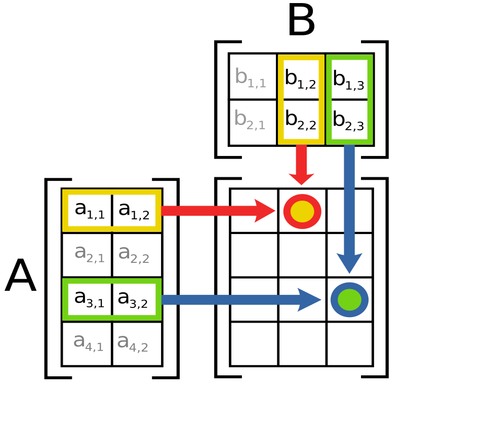
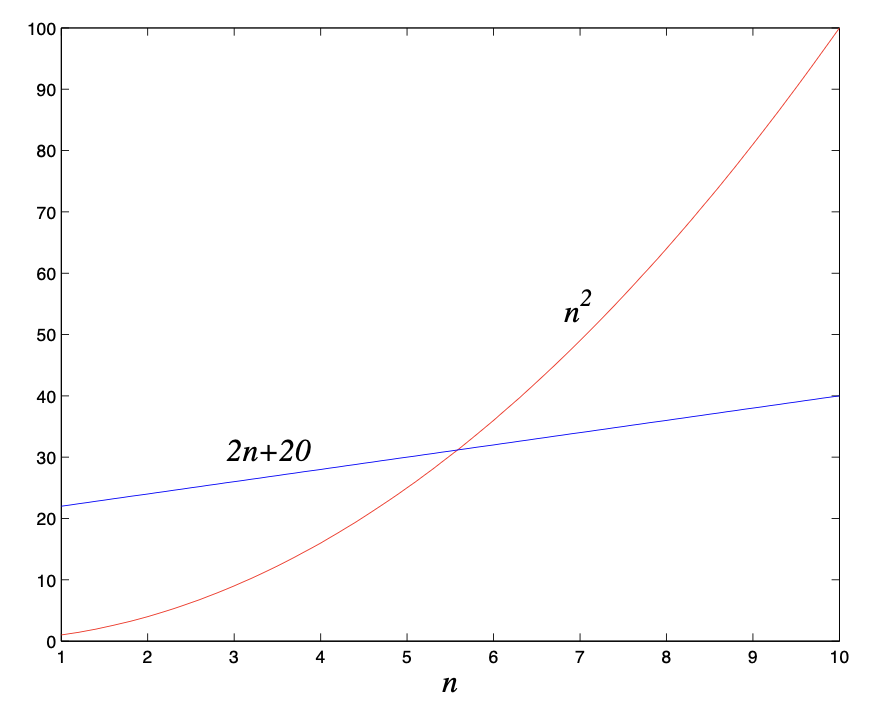
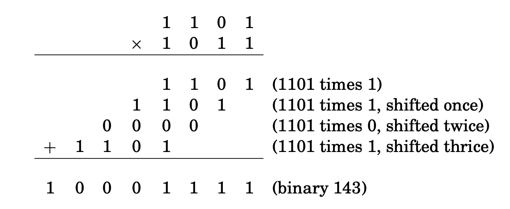
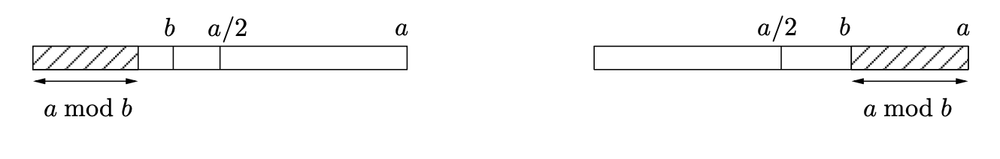

# Table of contents
- [Table of contents](#table-of-contents)
- [Chapter 0](#chapter-0)
  - [Вычисление чисел Фибоначчи](#вычисление-чисел-фибоначчи)
  - [Рекурсивный алгоритм](#рекурсивный-алгоритм)
  - [Итерационный алгоритм](#итерационный-алгоритм)
  - [Умножение матриц](#умножение-матриц)
  - [Матричный алгоритм](#матричный-алгоритм)
  - [O-символика](#o-символика)
    - [Пример](#пример)
- [Chapter 1](#chapter-1)
  - [Количество разрядов, необходимое для записи числа N](#количество-разрядов-необходимое-для-записи-числа-n)
  - [Сложение](#сложение)
  - [Умножение](#умножение)
  - [Алгоритм Евклида](#алгоритм-евклида)
  - [Проверка чисел на простоту](#проверка-чисел-на-простоту)
- [Chapter 2](#chapter-2)

<br>

# Chapter 0
Написав алгоритм, мы должны спросить себя:
1. Корректен ли он?
2. Каково время его работы? Время работы алгоритма это функция выражающая зависимость **числа операций** алгоритма от **размера входных данных** $`n`$. Обычно время работы алгоритма обознают через $`T(n)`$. Время работы алгоритма $`T(n)`$ означает, что алгоритм выполняет $`T(n)`$ элементарных операций на входе размера $`n`$. **Элементарная операция** - это операция, время выполнения которой не зависит от размера входных данных $`n`$ и которая всегда выполняется за **константное время** $`C`$ и имеет сложность $`O(1)`$.
3. Существует ли более быстрый алгоритм?

<br>

## Вычисление чисел Фибоначчи
В последовательности Фибоначчи
- $`F_{0} = 0`$
- $`F_{1} = 1`$
- $`F_{2} = 1`$
- $`F_{3} = 2`$
- $`F_{4} = 3`$
- $`F_{5} = 5`$
- $`F_{6} = 8`$
- ...

каждый член равен сумме двух предыдущих.<br>

<br>

**Рекуррентное соотношение** (**recurrence relation**) для вычисления чисел Фибоначчи:
$`F_{n} = \begin{cases} 
F_{n-2} + F_{n-1} & n > 1 \\ 
1 & n = 1 \\
0 & n = 0 \\
\end{cases}`$

<br>

Числа Фибоначчи растут почти также бысто, как степени двойки: например, $`F_{30}`$ **больше миллиона**, а в десятичной записи $`F_{100}`$ уже **21 цифра**.<br>

<br>

## Рекурсивный алгоритм
**Рекурсивная версия** для вычисления чисел Фибоначчи:
```rust
fib1(n)
if n= 0: return 0
if n= 1: return 1
return fib1(n−2) + fib1(n−1)
```

<br>

Данный алгоритм $`fib1(n)`$ корректен, т.к. повторяет определение.<br>
Время алгоритма при $`n \le 1`$ константно. Время работы алгоритма при $`n > 1`$: $`T(n) = T(n-2)`$ + $`T(n-1) + C_{1} + C_{2} + O(n)`$.<br>
Чтобы получить формулу для $`T(n)`$, заметим, что функция $`fib1(n)`$ содержит:
- **2 проверки** значения $`n`$, каждая выполняется за константное время $`C_{1}`$ и $`C_{2}`$;
  - $`C_{1} + C_{2}`$ можно заменить на $`O(1)`$ и вообще убрать из формулы;
- **2 рекурсивных вызова**, каждый из которых выполняется за меньшее время: $`T(n-2)`$ и $`T(n-1)`$;
- **сложение** результатов 2-х рекурсивных вызовов: $`O(n)`$, где $`n`$ количество разрядов в складываемых числах;
  - в двоичной записи **n-го** числа Фибоначчи $`0,694 \cdot n`$ бит, т.е. количество бит в числах Фибоначчи линейно зависит от порядкового номера самого числа, т.е. от $`n`$, поэтому можно считать, что и сложение линейно зависит от $`n`$;

<br>

Почему сложение имеет сложность $`O(n)`$? Если числа помещаются в регистр (**32** или **64** бита), то сложение можно считать элментарной операцией, имеющией **константную сложность** $`c = O(1)`$. Однако в двоичной записи **n-го** числа Фибоначчи $`0,694 \cdot n`$ бит, и они очень скоро перестают помещаться в регистры. *Сложение чисел произвольной длины* **не может** быть выполнено за 1 шаг, а значит **сложение чисел произвольной зависит от количества разрядов**. Сложение **2-х n-битовых чисел** требует времени, линейно зависящего от $`n`$, другими словами, сложение **2-х n-битовых чисел** имеет сложность $`O(n)`$.

<br>

Мы видим, что *время работы алгоритма растет* **экспоненциально** с ростом $`n`$.<br>

<br>

## Итерационный алгоритм
**Итерационная версия** для вычисления чисел Фибоначчи:
```rust
fib2(n)
if n=0 return 0
create an array f[0...n]
f[0]= 0
f[1]= 1
for i in 2..=n:
  f[i] = f[i−1] + f[i−2]
return f[n]
```

<br>

- `if n=0 return 0` выполняется за константное время, обозначим $`C_{1}`$
- `create an array f[0...n]` выполняется за константное время, обозначим $`C_{2}`$
- `f[0]= 0` выполняется за константное время, обозначим $`C_{3}`$
- `f[1]= 1` выполняется за константное время, обозначим $`C_{4}`$
- `for i in 2..=n:` выполняется за линейное время $`(n-1)`$, т.к. цикл повторяется $`(n-1)`$ раз, поэтому $`O(n)`$
  - пример для $`n=10`$:
```rust
1) n=2
2) n=3
3) n=4
4) n=5
5) n=6
6) n=7
7) n=8
8) n=9
9) n=10
```
- `f[i−1] + f[i−2]` сложение выполняется за линейное время $`O(n)`$
- `f[i] = ` присваивание результат сложения выполняется за константное время, обозначим $`C_{5}`$
- `return f[n]` взврат выполняется за константное время, обозначим $`C_{6}`$

<br>

Т.о. время работы алгоритма при $`n > 1`$: $`T(n) = C_{1} + C_{2} + C_{3} + C_{4} + C_{5} + C_{6} + (n-1) \cdot O(n) = O(n^{2}) + C`$

<br>


Мы видим, что время работы алгоритма **квадратично**: $`O(n^{2})`$.<br>

<br>

## Умножение матриц
<br>

Пусть даны две прямоугольные матрицы $`A`$ и $`B`$ размерности $`l \times m`$ и $`m \times n`$ соответственно:<br>
<br>
$`A = \begin{bmatrix}
a_{11} & a_{12} & \cdots & a_{1m} \\
a_{21} & a_{22} & \cdots & a_{2m} \\
\vdots & \vdots & \ddots & \vdots \\
a_{l1} & a_{l2} & \cdots & a_{lm} \\
\end{bmatrix}`$

<br>

$`B = \begin{bmatrix}
b_{11} & b_{12} & \cdots & b_{1n} \\
b_{21} & b_{22} & \cdots & b_{2n} \\
\vdots & \vdots & \ddots & \vdots \\
b_{m1} & b_{m2} & \cdots & b_{mn} \\
\end{bmatrix}`$

<br>

Тогда произведением $`A \times B`$ называется матрица $`C`$ размерностью $`l \times n`$:<br>
<br>
$`C = \begin{bmatrix}
a_{11} & a_{12} & \cdots & a_{1n} \\
a_{21} & a_{22} & \cdots & a_{2n} \\
\vdots & \vdots & \ddots & \vdots \\
a_{l1} & a_{l2} & \cdots & a_{ln} \\
\end{bmatrix}`$

<br>

в которой $`c_{ij} = \sum_{k=1}^m a_{ik}b_{kj}`$.<br>

<br>

Другими словами, **элемент матрицы** $`C = A \times B`$ с индексами $`i`$, $`j`$ есть **скалярное произведение** **i-ой** строки матрицы $`A`$ и **j-го** столбца матрицы $`B`$.<br>

<br>

Рассмотрим 2 квадратные матрицы размера $`n \times n`$, тогда асимптотика умножения 2-х квадратных матриц: $`O(n^3)`$, т.к. для вычисления $`n^{2}`$ элементов результирующией матрицы $`C`$ требуется выполнить $`n`$ операций умножения: $`n \cdot n^{2} = n^{3}`$.<br>

<br>

**Схема**:<br>


<br>

Значения на пересечениях, отмеченных кружочками, будут:
- $`(a_{11}, a_{12}) \cdot (b_{12}, b_{22}) = a_{11} \cdot b_{12} + a_{12} \cdot b_{22}`$
- $`(a_{31}, a_{32}) \cdot (b_{13}, b_{23}) = a_{31} \cdot b_{13} + a_{32} \cdot b_{23}`$

<br>

## Матричный алгоритм
**Q-матрица** (aka **матрица Фибоначчи**) это матрица вида:<br>
$`Q = \begin{bmatrix}
1 & 1 \\
1 & 0 \\
\end{bmatrix}`$

<br>

Чтобы найти **n-ое** число Фибоначчи $`F_{n}`$, достаточно возвести матрицу $`Q`$ в степень $`n-1`$ и взять **первый элемент первой строки**:<br>
$`Q^{n-1} = \begin{bmatrix}
F_{n} & F_{n-1} \\
F_{n-1} & F_{n-2} \\
\end{bmatrix}`$

<br>

Таким образом, вычисление $`F_{n}`$ сводится к возведению **Q-матрицы** в степень $`n-1`$. Возведение **Q-матрицы** в **N-ую** степень имеет сложность $`O(log N)`$. На практике, матричный алгоритм начинает уверенно обгонять итерационный начиная где-то с **n=300**.<br>

<br>

Если заменить $`n=k+1`$, то можно переписать в виде:
$`Q^{k} = \begin{bmatrix}
F_{k+1} & F_{k} \\
F_{k} & F_{k-1} \\
\end{bmatrix}`$

<br>

Можно показать, что: 
$`\begin{pmatrix} F_{n} \\ F_{n-1} \end{pmatrix} = \begin{bmatrix}
1 & 1 \\
1 & 0 \\
\end{bmatrix}^{n-1} \cdot \begin{pmatrix} F_{1} \\ F_{0} \end{pmatrix}`$

<br>

$`\begin{pmatrix} F_{2} =  1 \\ 1 \end{pmatrix} = \begin{bmatrix}
1 & 1 \\
1 & 0 \\
\end{bmatrix} \cdot \begin{pmatrix} 1 \\ 0 \end{pmatrix}`$

<br>

$`\begin{pmatrix} F_{3} = 2 \\ 1 \end{pmatrix} = \begin{bmatrix}
1 & 1 \\
1 & 0 \\
\end{bmatrix}^{2} \cdot \begin{pmatrix} 1 \\ 0 \end{pmatrix}`$

<br>

$`\begin{pmatrix} F_{4} = 3 \\ 2 \end{pmatrix} = \begin{bmatrix}
1 & 1 \\
1 & 0 \\
\end{bmatrix}^{3} \cdot \begin{pmatrix} 1 \\ 0 \end{pmatrix}`$

<br>

## O-символика
Пусть даны 2 функции $`f(n)`$ и $`g(n)`$, где $`n \in \mathbb{N}`$.<br>
Говорят, что $`f=O(g)`$, если существует такая константа $`c > 0`$, что $`f(n) \le c \cdot g(n) \;\; \forall n \in \mathbb{N}`$.<br>
Другими словами, $`f=O(g)`$ означает, что отношение $`f(n)`$ к $`g(n)`$ **ограничено сверху** некоторой **константой** $`\dfrac{f(n)}{g(n)} = С`$.<br>
Обозначение $`f=O(g)`$ можно считать аналогом $`\le`$ и читать как $`f`$ **растет не быстрее** $`g`$ **с точностью до константы**.<br>

<br>

Аналог для $`\ge`$ это **омега большое** $`\Omega`$: $`f = \Omega(g)`$ и читается как $`f`$ **растет не медленнее** $`g`$ **с точностью до константы**.<br>
Аналог для $`=`$ это **тетта большое** $`\Theta`$: $`f = \Theta(g)`$ и читается как $`f`$ и $`g`$ **имеют одинаковый порядок роста** $`g`$.<br>

<br>

**Следствия**:
- $`f = \Omega(g) \implies g = O(f)`$
- $`f = \Theta(g) \implies f = O(g) \;\; \text{AND} \;\; g = O(f)`$

<br>

### Пример
Пусть один алгоритм требует $`q(n)=n^{2}`$ шагов, а второй требует $`l(n)=2n+20`$ шагов, $`q`$ означает **квадратичную** (**quadratic**) зависимость, $`l`$ означает **линейную** (**linear**) зависимость. Какой из них лучше?<br>
Это зависит от значения $`n`$:
- при $`n \le 5`$ первый лучше
- при $`n \ge 6`$ второй лучше

<br>



<br>

Можно записать:
- $`l=O(q)`$
- но $`q \ne O(l)`$

<br>

В самом деле:
- отношение $`\dfrac{l(n)}{q(n)} = \dfrac{2n+20}{n^{2}} = \dfrac{2}{n} + \dfrac{20}{n^{2}} \le 22`$ **ограничено сверху**;
- а отношение $`\dfrac{q(n)}{l(n)} = \dfrac{n^{2}}{2n+20} \ge \dfrac{n^{2}}{22 \cdot n} = \dfrac{n}{22}`$ **не ограничено сверху**;

<br>

Пусть есть еще один ленейный алгоритм алгоритм, $`l_{2}=n+1`$. Лучше ли он чем $`l`$? Да, но всего в несколько раз: $`l=\Theta(l_{2})`$. В самом деле:
- отношение $`\dfrac{l(n)}{l_{2}(n)} = \dfrac{2n+20}{n+1} \le 20`$ **ограничено сверху**;
- и отношение $`\dfrac{l_{2}(n)}{l(n)} \le 1`$ **ограничено сверху**;

<br>

**Общие правила**:
- постоянные множители можно **опускать**;
  - например $`14 \cdot n`$ можно заменить на $`n`$;
- $`n^{a}`$ растет **быстрее** $`n^{b}`$ если $`a > b`$;
  - например $`n^{2} + 3n + 1`$ можно заменить на $`n^{2}`$;
- любая **экспонента** растет **быстрее** любого **полинома**;
  - например, $`3^{n}`$ растет быстрее $`n^{100}`$;
- любой **полином** растет **быстрее** любого **логарифма**;
  - например, $`n`$ и даже $`\sqrt{n}`$ растут быстрее $`(log n)^{3}`$;
  - основание логарифма не указывается в $`O`$ нотации, т.к. замена основания приводит лишь к умножению на константу;
    - переход от основания логарифма $`a`$ к другому основанию $`b`$, $`N`$ - аргумент логарифма: $`{log_{b}N} = log_{a}N \cdot log_{b}{a}`$;
    - по этой причине в O-символике основание логарифма обычно не указывается;


<br>

# Chapter 1
## Количество разрядов, необходимое для записи числа N
При помощи $`k`$ цифр моно записать числа от $`0`$ по $`r^{k} - 1`$.<br>
Для записи числа $`N`$ в системе счисления с основанием $`r`$ нужно $`\lfloor log_{r}(N+1) \rfloor`$ разрядов.<br>


Как меняется чило разрядов при переходе от одной системы счисления к другой? Переход от основания логарифма $`a`$ к другому основанию $`b`$, $`N`$ - аргумент логарифма: $`{log_{b}N} = log_{a}N \cdot log_{b}{a}`$. Значит при переходе от основания $`a`$ к основанию $`b`$ количество разрядов увеличивается в $`log_{b}{a}`$ раз.<br>

Т.о. для записи числа $`N`$ нужно $`O(logN)`$ цифр, вне зависимости от системы счисления. По этой причине в O-символике основание логарифма обычно не указывается.<br>

<br>

## Сложение
Допустим, что $`x`$ и $`y`$ два числа длиной $`n`$ бит. Тогда результат их суммы будет не более $`n+1`$ бит. Вычисление суммы 2-х бит уходит элементарная операция, не зависящая от $`n`$, она выполняется за константное время, обозначим эту константу $`c_{1}`$. Тогда общее время суммирования **линейно**: нам нужно сложить $`n`$ бит, что требует $`c_{0} c_{1} \cdot n`$ операций, $`c_{0}`$ перенос последнего бита. Эти константы нас не интересуют, поэтому получаем, что сложность операции сложения $`O(n)`$.<br>

<br>

## Умножение
Алгоритм умножения столбиком заключается в том, чтобы умножить каждую цфиру второго числа на каждую цифру первого, при этом результат для каждого следующего разряда второго числа смещается на 1 разряд влево. 

<br>

Пример перемножения чисел в двоичной системе счисления:


<br>

Для двух чисел размером $`n`$ бит мы получаем $`n`$ промежуточных результатов, каждый не более чем $`2n`$ бит.<br>
Перемножение каждого разряда одного числа на все разряды другого имеет сложность $`O(n)`$, после чего требуется сложить $`n`$ промежуточных результатов, в итоге получаем: 
$`\underbrace{O(n)+O(n)+...+O(n)}_{n-1} = (n-1) \cdot O(n) = O(n^{2})`$.<br>

<br>

## Алгоритм Евклида
**Алгоритм Евклида** находит **НОД** (**GCD**) двух чисел $`a`$ и $`b`$, т.е. такое максимальное натуральное число, на которое одновременно делятся и $`a`$ и $`b`$.<br>
**Правило Евклида**: для любых целых чисел $`a \ge b \ge 0`$ выполняется равенство $`gcd(a,b) = gcd(b, a mod b)`$.<br>

**Правило Евклида** позволяет записать элегантный рекурсивный алгоритм:
```rust
euclid(a,b)
if b=0: return a
return euclid(b, a mod b)
```

<br>

Для оценки времени работы алгоритма, нужно понять, как быстро уменьшаются значения аргментов. От пары $`(a,b)`$ алгоритм переходит к паре $`(b, a mod b)`$, т.е. большее из чисел заменяется на его остаток от деления на меньшее.<br>

<br>

**Лемма**: если $`a \ge b`$, то $`(a \bmod b) \lt \dfrac{a}{2}`$.<br>
*Доказательство*.<br>
<br>
Если $`b \le \dfrac{a}{2}`$, то $`(a \bmod b) \lt b \le \dfrac{a}{2}`$.<br>
<br>
Если $`b \gt \dfrac{a}{2}`$, то $`(a \bmod b) = (a - b) \lt \dfrac{a}{2}`$.<br>

<br>



<br>

Данная лемма гарантирует, что после двух последовательных рекурсивных вызовов оба числа уменьшатся хотя бы вдвое, другими словами, длина каждого из них уменьшится хотя бы на 1 бит. Таким образом, будет произведено не более $`2n`$ рекурсивных вызовов, а поскольку на каждом из них приозводится деление, которое имеет сложность $`O(n^{2})`$, **общее время работы будет** $`O(n^{3})`$.<br>

<br>

## Проверка чисел на простоту
**Малая теорема Ферма** (**тест Ферма**). Для любого простого числа $`p`$ и любого натурального числа $`a`$, такого что $`1 \le a \le (p-1)`$, выполняется сравнение: $`a^{p-1} \equiv 1 \pmod{p}`$.<br>

<br>

**Пример**: $`a^{6} \equiv 1 \pmod{7}`$.<br>

<br>

Данная теорема позволяет установить, что число $`N`$ составное, не находя его делителей: достаточно убедиться, что $`a^{N-1} \not\equiv 1 \pmod{N}`$ при некотором $`a \le (p-1)`$.<br>

Условие в *тесте Ферма* является **достаточным**, но **не является необходимым**: если $`N`$ **составное**, то **оно** тоже **может проходить** *тест Ферма*.<br>
Может быть для составных чисел не очень много значений $`a`$ при котоырх выполняется *тест Ферма*?<br>
Плохая новость: **существуют составные числа** $`N`$, которые **проходят** *тест Ферма* **для всех** $`a`$ **взаимно простых с** $`N`$. Такие числа называются **числа Кармайкла** (**Carmichael numbers**).<br>

<br>

Пример: наименьшее **число Кармайкла** равно **561**. Оно является **составным** и в то же время **проходит тест Ферма для всех** $`a`$, **взаимно простых с** **561**.<br>

<br>

Для всех чисел $`N`$, кроме чисел Кармайкла верны следующие утверждения:
- если $`N`$ **простое**, то $`a^{N-1} \not\equiv 1 \pmod{N}`$ для всех $`a \lt N`$;
- если $`N`$ **составное**, то $`a^{N-1} \not\equiv 1 \pmod{N}`$ для не более чем половины всех $`a \lt N`$;

<br>

**Числа Крмайкла встречаются достаточно редко**. Если при проверке числа $`N`$ выбирать число $`a`$ из диапазона $`[1; N-1]`$ **случайным образом**, то можно получить **вероятностный алгоритм** (**probabilistic algorithm** /ˌprɒb.ə.bəlˈɪs.tɪk/), который проверяет числа на простоту и довольно хорошо работает на всех числах, кроме чисел Кармайкла:
```rust
fn primality(N)
Input: Positive integer N
Output: yes/no
Pick a random positive integer a < N
if a^(N−1) ≡ 1 (mod N): return yes
else: return no
```

<br>

Для данного алгоритма верны следующие вероятностные оценки:
- если $`N`$ **простое**, то алгоритм возвращает **yes** с вероятностью $`P=1`$;
- если $`N`$ **составное**, то алгоритм возвращает **no** с вероятностью $`P \le \dfrac{1}{2}`$, другими слоами, мы можем **ошибочно** принять составное число за простое с вероятностью $`P \le \dfrac{1}{2}`$;
- если $`N`$ **число Кармайкла**, то алгоритм возвращает **yes** с вероятностью $`P=1`$;

<br>

**Вероятность ошибки можно уменьшить**, повторив тест для $`k \gt 1`$ случайно выбранных $`a`$, с ростом $`k`$ вероятность ошибки экспоненциально убывает: $`P \le \dfrac{1}{2^{k}}`$.<br>

<br>

Т.о. можно модифицировать алгоритм `primality(N)` таким образом:
```rust
fn primality2(N)
Input: Positive integer N
Output: yes/no
Pick k random positive integer a_1, a_2, ..., a_k < N
if a_i^(N−1) ≡ 1 (mod N) for all i in 1..=k: return yes
else: return no
```

<br>

Миллер и Рабин предложили более сложный вероятностный алгоритм (**Miller–Rabin primality test** /praɪˈmæl.ə.ti/), который **годится и для чисел Кармайкла**.<br>

<br>

# Chapter 2
