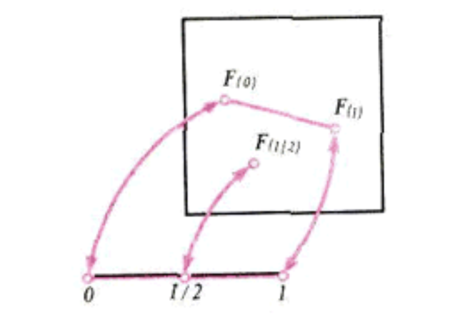

# Table of contents
- [Table of contents](#table-of-contents)
- [Может ли часть равняться целому?](#может-ли-часть-равняться-целому)
	- [Примеры эквивалентных множеств](#примеры-эквивалентных-множеств)
- [Отношения эквивалентности и разбиения множеств](#отношения-эквивалентности-и-разбиения-множеств)
	- [Что такое отношение?](#что-такое-отношение)
		- [Пример: рациональные числа](#пример-рациональные-числа)
- [Метод неподвижных точек](#метод-неподвижных-точек)
- [Что такое размерность?](#что-такое-размерность)

 

# Может ли часть равняться целому?
**Может ли часть равняться целому?** Конечно **не может**. **Часть всегда меньше целого**. **Евклид принял это утверждение за аксиому**.

Возьмем множество всех натуральных чисел {1,2,3,4, ... } и в нем подмножество всех четных чисел {2,4,6, ... }. Второе часть целого.

Составим таблицу, в которой под каждым натуральным числом запишем определенное четное число, причем ни одно не пропущено и ни одно не повторяется:

| 1   | 2   | 3   | 4   | ... | 100 | 101 | ... |
| --- | --- | --- | --- | --- | --- | --- | --- |
| 2   | 4   | 6   | 8   | ... | 200 | 202 | ... |

Два множества A и B равны, если каждый элемент множества A принадлежит элементу множества B и наоборот - каждый элемент множества B принадлежит элементу множества A, т.е. эти множества состоят из одних и тех же элементов.

Получается, *множество натуральных чисел* **не равно** *множеству четных чисел*.

Рассмотрим еще одну таблицу:

| 1   | 2   | 3   | 4   | ... | 100 | 101 | 102 | ... |
| --- | --- | --- | --- | --- | --- | --- | --- | --- |
|     | 2   |     | 8   | ... | 100 |     | 102 | ... |

Получается, что **четных** чисел все же **меньше** чем **натуральных**?

Пусть нам даны 2 конечных множества и требуется сравнить их количественно, т.е. выяснить поровну ли они содержат элементов или нет. Есть способ для количественного сравнения двух множеств, который легко переносится на случай бесконечных множеств.

Пусть нам даны 2 множества: А и B, конечны они или нет - неважно. Множество A **взаимно однозначно отображается** на множество B, если **существует соответствие**, при котором **каждому** элементу a множества A соответствует определенный элемент множества B, и при этом **каждый** элемент b соответствует **единственному** a. Тогда из элементов множеств A и B можно составить пары (a,b) с соблюдением следующих условий:
- первый компонент пары - элемент множества A, второй - элемент множества B;
- каждый элемент как множества A, так и множества B входит **в одну и только одну пару**;

Очевидно, что для двух множеств A = {1,2} и B={a,b} можно составить несколько наборов таких пар, чтобы указанные условия выполнялись:
- (1,a), (2,b)
- (2,a), (1,b)

Это показывает, что, как правило, *одно множество на другое можно отобразить взаимно однозначно* **несколькими способами**.

Вместо того, чтобы говорить: "множество $`A`$ **взаимно однозначно отображается на** $`A`$" говорят $`A`$ **эквивалентно** $`B`$ или $`A`$ **равномощно** $`B`$ и пишут $`A \sim B`$.
Итак, $`A`$ **эквивалентно** $`B`$  если его **можно**, **подчеркиваю** - *можно* **взаимно однозначно отобразить на**  $`B`$.

Если два конечных множества эквивалентны - то в них поровну элементов. Для конечных множеств все просто.

Однако, для бесконечных множеств все сложнее. У бесконечных множеств **часть может быть эквивалентна целому**.

 

## Примеры эквивалентных множеств
- Т.к. существует взаимно однозначное отображение множества **натуральных** чисел на множество **четных** чисел, то эти множества **эквивалентны**.
- Множества точек на двух концентрических окружностях - **эквивалентны**. Расcмотрим две концентрические окружности с центром в точке $`O`$: $`(O, r)`$ и $`(O, R)`$. Возьмем на окружности $`(O, r)`$ некоторую точку $`A`$ и проведем радиус $`OA`$. Пусть продолжение этого радиуса пересекает $`(O,R)`$ в точке $`A'`$. Т.о. каждой точке $`A \in (O, r)`$ соответствует полученная таким образом точка $`A' \in (O, R)`$. Т.о. мы получили взаимно однозначное отображение $`(O, r)`$ на $`(O, R)`$, т.е. $`(O, r) \sim (O, R)`$.
- Возьмем отрезок $`[0,1]`$ и отрезок $`[a,b]`$, где $`a`$ и $`b`$ - произвольные числа. Эти отрезки оказываются **эквивалентными**, хотя отрезок $`[a,b]`$ может оказаться во много раз длиннее или короче отрезка $`[0,1]`$. Доказать эту эквивалентность можно так. Рассмотрим функцию $`y=a+(b-a) \cdot x`$. При изменении $`x`$ в **области определения** $`[0,1]`$ значение $`y`$ будет меняться от  $`a`$ до $`b`$, т.е. **множеством значений** этой функции будет $`[a,b]`$. А т.к. при этом $`x=\dfrac{y-a}{b-a}`$, то каждое $`y`$ будет соответствовать одному $`x`$.
- **отрезок** $`I`$ и **квадрат** $`I^{2}`$ - **равномощны**;
- множество **пар** натуральных чисел **равномощно** множеству натуральных чисел: $`\{n\} \sim \{n_{i}, n_{j}\}`$, пример, как можно установить биекцию:
	- числу $`n=2^{n_{1}-1}(2n_{2}-1)`$ ставится в соответствие пара $`(n_{1}; n_{2})`$;
	- $`1 \rightarrow (1;1) `$
	- $`2 \rightarrow (2;1) `$
	- $`3 \rightarrow (1;2) `$
	- $`4 \rightarrow (3;1) `$
	- $`5 \rightarrow (1;3) `$
	- ...
	- $`28 \rightarrow (3;4) `$

 

# Отношения эквивалентности и разбиения множеств
Когда нам требуется изучить объекты какого-нибудь множества в связи с какими-нибудь их свойствами, мы стремимся **разбить это множество на классы так**, чтобы все **элементы одного класса вели себя одинаковым образом** по отношению к интересующим нас свойствам, и тогда появляется возможность **изучать целый класс объектов по одному его представителю**.

**Разбиение множества на непересекающиеся классы** - это такое **распределение его элементов по классам**, при котором **каждый элемент попадает в один и только в один класс**. При разбиении используются признаки, присущие элементам данного множества.

Например есть множество геометрических фигур разных форм, размеров и цветов, соответственно данное множество **разбить на классы** *по цвету*, *по форме* или *по размеру*.

Для разбиения множества на классы нам нужны **не столько** **свойства**, присущие каждому элементу **в отдельности**, **сколько правила**, указывающие, **в один** или **в разные** классы **следует** отнести **два** произвольно выбранных **элемента** множества. И в таком случае про построенное **разбиение на непересекающиеся классы** говорят, что оно **индуцировано отношением**. Например, *разбиение множества фигур по цвету* **индуцировано** **отношением** *иметь одинаковый цвет*.

 

## Что такое отношение?
В общем случае **отношением** **на множестве** $`M`$ называют **высказывание об элементах** множества $`M`$, зависящее от $`n`$ переменных и превращающееся в **истинное** или **ложное** высказывание **при подстановке в него** вместо переменных **любых конкретных элементов** из $`M`$. Если $`n=2`$, то отношение называется **бинарным**. Обычно **бинарное отношение** записывают в виде $`aRb`$  и говорят отношение $`R`$.

Если отношение $`aRb`$ **истинно**, то говорят также что $`a`$ и $`b`$ **связаны отношением** $`R`$ или **находятся в отношении** $`R`$.

- Если отношение $`aRb`$ обладает тем свойством, что из истинности $`aRb`$ всегда следует истинность $`bRa`$ **для любых** $a$ и $`b`$ из $`M`$, то отношение $`R`$ называется **симметричным**.
- Если отношение $`aRa`$ **истинно** **для любого** элемента $a$ из $`M`$, то отношение $`R`$ называется **рефлексивным**.
- Если отношение $`aRb`$ обладает тем свойством, что из истинности $`aRb`$ и  $`bRc`$всегда следует истинность $`aRc`$ **для любых** $a$ и $`b`$ из $`M`$, то отношение $`R`$ называется **транзитивным**.

 

Свойства **рефлексивности**, **симметричности** и **транзитивности** независимы, т.е. каждое из этих свойств **не является** следствием других.

 

**Примеры**:
- отношение **перпендикулярности** прямых - **не рефлексивно** и **не транзитивно**, но при этом **симметрично**;
- отношения **строго меньше** $`<`$ и **строго больше** $`>`$ для чисел **не симметричны** и **не рефлексивны**, т.к. $`1 < 2`$ - **истинно**, а $`2 < 1`$ - **ложно**;
- отношение **параллельности** прямых - **рефлексивно**, **симметрично** и **транзитивно**;
-  отношение **равенства** чисел - **рефлексивно**, **симметрично** и **транзитивно**;

**Какими свойствами должно обладать отношение** $`R`$, чтобы множество $`M`$ можно было разбить на непересекающиеся классы, чтобы:
- **любые** два элемента из **одного** класса **находились** в отношении $`R`$;
- **никакие** два элемента из **разных** класса **не находились** в отношении $`R`$;
?

**Теорема**. Отношение $`R`$ на множестве $`M`$ тогда и только тогда **индуцирует разбиение** множества $`M`$, когда оно **рефлексивно**, **симметрично** и **транзитивно**.

Пусть отношение  $`R`$ на множестве $`M`$ **рефлексивно**, **симметрично** и **транзитивно**. Пусть $`a`$ произвольный элемент из $`M`$. Обозначим через $`M_{a}`$ класс всех таких элементов $`x`$ из $`M`$, для которых истинно $`aRx`$, более формально: $`M_{a} = \{x \, |\, \, aRx \, - \, true\}`$.

Любые два класса $`M_{a}`$ и $`M_{b}`$ или **совпадают** или **не пересекаются**. Каждый элемент множества $`M`$ **содержится только в одном классе** и **никакие два класса не пересекаются**.

Элементы, содержащиеся в одном классе, обычно называют эквивалентными. В связи с этим всякое **рефлексивное**, **симметричное** и **транзитивное** отношение называют **отношением эквивалентности**, а сами классы получаемого разбиения - **классами эквивалентности**.

Таким образом, если нам нужно выяснить, **индуцирует ли** некоторое **отношение** $`R`$ **разбиение** какого-либо **множества** $`M`$, то **нужно проверить**, **является ли отношение $`R`$ отношением эквивалентности**.

 

### Пример: рациональные числа
Рассмотрим множество $`Q`$ всех дробей $`\dfrac{a}{b}`$, где $`a`$ и $`b`$ - целые числа, и $`b \ne 0`$. Определим на нем отношение $`R`$ следующим образом: $`\dfrac{a}{b} R \dfrac{c}{d}`$ тогда и только тогда, когда $`a \cdot d = b \cdot c`$. Получается, что **рациональное число** это не просто дробь, а **целый класс эквивалентных дробей**.

 

# Метод неподвижных точек

Рассмотрим задачу: два путника идут навстречу друг другу, пусть $`x`$ ($`a \le x \le b`$) - координата первого, $`y`$  ($`a \le y \le b`$) - координата второго. Каждому значению $`x`$ соответствует единственное значение $`y`$. Имеем функцию $`y = f(x)`$, а уравнение $`f(x) = x`$ определяем координату (место) встречи.

Очевидно встреча путников неизбежна. Однако это "очевидно" нас не устраивает. Необходимо формализовать.

Предположим, что функция $`f(x)`$ **отображает** **отрезок** $`[a,b]`$ **в себя**, т.е. для всех $`x \in [a,b]`$ имеем $`a \le f(x) \le b`$. Тогда **всякое решение уравнения** $`f(x) = x`$ называется **неподвижной точкой отображения** $`f`$.

**Теорема**. У каждой **непрерывной** функции $`f`$, **отображающей отрезок** $`[a,b]`$ **в себя**, **существует неподвижная точка**.

Пусть, $`M`$ - множество точек, $`f`$ - **отображение множества в себя**: оно каждой точке $`x \in M`$ ставит в соответствие ее образ $y = f(x) \in M$. Такое отображение называется **непрерывным**, если для любой точки $`x_{0} \in M`$ и любого $`E>0`$ существует такое $`\delta > 0`$, что для всех точек $`x \in M`$, удаленных от $`x_{0}`$ на расстояние, **меньшее** $`\delta`$, расстояние между их образами $`f(x)`$ и $`f(x_{0})`$ оказывается **меньше** $`E`$.

Если $`f(x) = x`$ то **точка** $`x \in M`$ **называется** **неподвижной точкой отображения** $`f`$.

 

**Теорема Брауэра**. У всякого непрерывного отображения круга в себя существует неподвижная точка.

Теорема Брауэра отвечает на вопрос: **когда** **у непрерывного отображения** **обязательно есть непрерывная точка**?

 

# Что такое размерность?
Одна из последних статей великого ученого Анри Пуанкаре, опубликованная в вышедшем уже после его смерти сборнике "последние мысли", называлась "Почему пространство имеет 3 измерения?". В этой статье Пуанкаре размышляет над вопросом, **что такое число измерений**, или **что такое размерность**.

Пуанкаре пишет: Можно установить взаимно однозначное соответствие между точками отрезка и квадрата, между точками прямой и плоскости. Это возможно, пока мы не связываем себя **условием**, чтобы двум **близким** точкам **прямой** **соответствовали** бы **близкие** точки плоскости **и** **наоборот**.

Пуанкаре считал **невозможным** такое отображение, которое бы отображало отрезок на квадрат и было бы при этом **взаимно однозначным** и **непрерывным**  **в обе стороны**.

**Теорема**. **Не существует** *взаимно однозначного* и *непрерывного* **в обе стороны** отображения отрезка на квадрат.
Рассмотрим в квадрате образы отрезка:

Нашему пути вдоль **линии** *на квадрате* соответствует **непрерывный путь** *на отрезке* от **0** до **1**, но на этом **пути** обязательно **встретится точка 1/2**, а на **пути** вдоль **линии** *на квадрате* **образ точки 1/2** **не встретится**.

Таким образом, мы **можем** **разделить линию** точкой, но мы **не можем разделить поверхность точкой**, чтобы **разделить поверхность** - **нужная линия**. А чтобы **разделить пространство** уже **нужна поверхность**.

Пуанкаре предложил **определять размерность** **индуктвно**, пользуясь идеей сечения или разбиения.

Оказалось, что *индуктивный способ определения размерности* - **не единственный**. возможен еще один подход, предложенный Лебегом и Брауэром.

**Теорема Лебега**. При любом разбиении **n-мерного объекта** на части достаточно малого размера найдутся **n+1 частей**, имеющих **общую граничную точку**.

Например, как бы не делили **квадрат** прямоугольниками, всегда найдутся **2+1** попарно смежные прямоугольника, у которых будет **1** **общая граничная точка**. Соответсвенно, **квадрат** - **двухмерный**.

