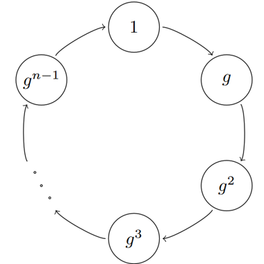
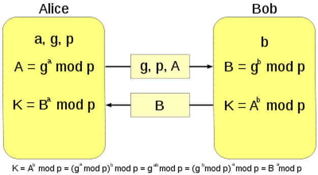

# Table of contents
- [Table of contents](#table-of-contents)
- [Как работает умножение](#как-работает-умножение)
- [Системы счисления](#системы-счисления)
- [Умножение в столбик](#умножение-в-столбик)
- [Делимость чисел](#делимость-чисел)
- [Признаки делимости](#признаки-делимости)
  - [Признаки делимости на 2, 5 и 10](#признаки-делимости-на-2-5-и-10)
  - [Признаки делимости на 9 и 3](#признаки-делимости-на-9-и-3)
- [Деление с остатком](#деление-с-остатком)
  - [Пример нахождения остатка и неполного частного при делении отрицательного числа](#пример-нахождения-остатка-и-неполного-частного-при-делении-отрицательного-числа)
- [Критерии делимости](#критерии-делимости)
- [НОД](#нод)
  - [Свойства НОД](#свойства-нод)
- [Алгоритм Евклида](#алгоритм-евклида)
- [Соотношение Безу](#соотношение-безу)
- [Расширенный алгоритм Евклида](#расширенный-алгоритм-евклида)
- [Простые числа](#простые-числа)
  - [Алгоритм проверки числа на простоту](#алгоритм-проверки-числа-на-простоту)
- [Связь факториала с составными числами](#связь-факториала-с-составными-числами)
- [Основная теорема арифметики](#основная-теорема-арифметики)
- [Нахождение НОД через основную теорему](#нахождение-нод-через-основную-теорему)
- [Наименьшее общее кратное](#наименьшее-общее-кратное)
- [Связь между НОД и НОК](#связь-между-нод-и-нок)
- [Количество делителей числа](#количество-делителей-числа)
- [Модульная арифметика](#модульная-арифметика)
  - [Теорема](#теорема)
- [Свойства сравнений](#свойства-сравнений)
  - [Сокращение сравнения по модулю на число](#сокращение-сравнения-по-модулю-на-число)
- [Теорема Эйлера](#теорема-эйлера)
- [Малая теорема Ферма](#малая-теорема-ферма)
  - [Обратное по модулю](#обратное-по-модулю)
- [RSA](#rsa)
  - [Пример с маленькими числами](#пример-с-маленькими-числами)
- [Китайская теорема об остатках](#китайская-теорема-об-остатках)
- [Классы вычетов](#классы-вычетов)
  - [Система вычетов по модулю m](#система-вычетов-по-модулю-m)
  - [Кольца vs. Поля](#кольца-vs-поля)
  - [Кольцо вычетов по модулю m](#кольцо-вычетов-по-модулю-m)
  - [Поле вычетов по модулю m](#поле-вычетов-по-модулю-m)
- [Деление классов вычетов](#деление-классов-вычетов)
- [Первообразные корни](#первообразные-корни)
- [Группы. Подгруппы. Кольца. Поля](#группы-подгруппы-кольца-поля)
  - [Группа](#группа)
    - [Подгруппа](#подгруппа)
    - [Циклическая группа](#циклическая-группа)
  - [Кольцо](#кольцо)
  - [Делители нуля](#делители-нуля)
  - [Поле](#поле)
    - [Поля Галуа](#поля-галуа)
  - [Мультипликативная группа кольца вычетов по модулю m](#мультипликативная-группа-кольца-вычетов-по-модулю-m)
- [Diffie-Hellman (DH)](#diffie-hellman-dh)

 

# Как работает умножение
Свойства умножения:
- **коммутативность** (aka *переместительный закон умножения*)
  - a*b = b*a
    - от перемены мест множителей произведение не меняется
- **ассоциативность** (aka *сочетальный закон умножения*)
  - (a*b)*c = a*(b*c)
    - когда множетелй больше 2-х порядок умножения не влияет на результат
- **дистрибутивность** (aka *распределительный закон умножения* или *правила раскрытия скобок*)

 

# Системы счисления
Тот способ записи чисел, который мы используем, называется **десятичная система**. 
В ней используется 10 цифр, которые называются **арабскими цифрами**. 
Считается, что количество цифр связано с количеством пальцев на руках человека. 

 

Также в древности многие народы использовали **двенадцатиричную систему**. 
Она связана с количеством фаланг на четырех пальцев (кроме большого) и возникла, когда люди считали предметы не загибая пальцы, а указывая большим пальцем на фаланги остальных четырех пальцев той же руки. 
**Дюжина** это десять в **двенадцатиричной системе**, т.е. в *десятиричной системе* это *12*. 

 

# Умножение в столбик
Допустим, есть число 23456. За что отвечает каждая его цифра? 
Число 23456 можно представить в виде: $`23456 = 2\cdot10^{4} + 3\cdot10^{3} + 4\cdot10^{2} + 5\cdot10^{1} + 6\cdot10^{0}`$. 
На этом свойстве и на свойстве дистрибутивности умножения основан **метод умножения в столбик**. 

Пусть нам надо умножить **1234** на **23456**, переписав 23456 в виде суммы, получим: 
$`1234 \cdot 23456 = 1234 \cdot (2 \cdot 10^{4} + 3 \cdot 10^{3} + 4 \cdot 10^{2} + 5 \cdot 10^{1} + 6 \cdot 10^{0})`$

 

Нам нужно **1234** умножить на каждый член в разложении 23456:
- $`1234 \cdot 2 \cdot 10^{4}`$
- $`1234 \cdot 3 \cdot 10^{3}`$
- $`1234 \cdot 4 \cdot 10^{2}`$
- $`1234 \cdot 5 \cdot 10^{1}`$
- $`1234 \cdot 6 \cdot 10^{0}`$

 

В свою очередь число **1234** тоже можно представить в виде суммы: $`1234 = 1 \cdot 10^{3} + 2 \cdot 10^{2} + 3 \cdot 10^{1} + 4 \cdot 10^{0}`$. 

 

Рассмотрим, например, $`1234 \cdot 6 \cdot 10^{0}`$:
- $`1234 \cdot 6 = (1 \cdot 10^{3} + 2 \cdot 10^{2} + 3 \cdot 10^{1} + 4 \cdot 10^{0}) \cdot 6`$
  - $`= 6 \cdot 10^{3} + 12 \cdot 10^{2} + 18 \cdot 10^{1} + 24 \cdot 10^{0}`$
  - $`= 6 \cdot 10^{3} + (2 + 10) \cdot 10^{2} + (8 + 10) \cdot 10^{1} + (4 + 2 \cdot 10) \cdot 10^{0}`$
  - $`= 6 \cdot 10^{3} + 2 \cdot 10^{2} + 1 \cdot 10^{3} + 8 \cdot 10^{1} + 1 \cdot 10^{2} + 4 \cdot 10^{0} + 2 \cdot 10^{1}`$
  - $`= 7 \cdot 10^{3} + 3 \cdot 10^{2} + 10 \cdot 10^{1} + 4 \cdot 10^{0}`$
  - $`= 7 \cdot 10^{3} + 4 \cdot 10^{2} + 0 \cdot 10^{1} + 4 \cdot 10^{0}`$
  - $`=7404`$
- после чего нужно умножить $`7404`$ на $`10^{0}`$, получится тоже самое число;

 

При умножении **1234** на более старшие разряды, результат нужно будет умножать на соответствующую **степень 10**, что означает **сдвиг числа влево** на соответствующее количество разрядов, что используется в методе умножения столбиком. 

 

# Делимость чисел
**Целое** число $`a`$ делится на **натуральное** число $`b`$ ($`b \ge 1`$), если найдется такое **целое** число $`q`$, что $`a = b \cdot q`$ (вместо $`q`$ часто еще используют $`k`$ которое пишут перед $`b`$: $`a = k \cdot b`$). 
При этом говорят, что
- $`a`$ **делимое**;
- $`b`$ **делитель** числа $`a`$;
- $`q`$ **частное**;
- число $`a`$ **кратно** числу $`b`$;

 

Тот факт, что $`a`$ делится на $`b`$ записывают так: $`a \vdots b`$, в англоязычной литературе чаще пишут так: $`b \vert a`$ (читается $`b`$ делитель $`a`$). 

Числа **делящиеся** на **2**, называются **четными**, а **не делящиеся** на **2** - **нечетными**. 

Свойства делимости:
1. **Ноль** делится на любое натуральное число.
   - для любого натурального числа $`a`$ верно равенство $`0 = 0 \cdot a`$, значит $`0`$ **делится на** $`a`$;
   - **частное** всегда равно **0**, другими словами, любое число **входит в** $`0`$ ровно $`0`$ **раз**;
2. Любое натуральное число делится **на 1** и **само на себя**.
   - для любого натурального числа $`a`$ верны равенства:
     - $`a = 1 \cdot a`$, в данном случае **частное** $`q`$ равно $`a`$, т.е. $`1`$ входит в $`a`$ ровно $`a`$ раз;
     - $`a = a \cdot 1`$, в данном случае **частное** $`q`$ равно $`1`$, т.е. $`a`$ входит в $`a`$ ровно $`1`$ раз;
3. Если $`a_{1} \vdots b`$ и $`a_{2} \vdots b`$, то $`(a_{1} + a_{2}) \vdots b`$ и $`(a_{1} - a_{2}) \vdots b`$.
   - если $`a_{1} \vdots b`$ и $`a_{2} \vdots b`$, то существуют такие целые $`k_{1}`$ и $`k_{2}`$, что $`a_{1} = k_{1} \cdot b`$ и $`a_{2} = k_{2} \cdot b`$;
   - соответственно:
     - $a_{1} + a_{2} = k_{1} \cdot b + k_{2} \cdot b = (k_{1} + k_{2}) \cdot b$, следовательно делится на $`b`$;
     - $a_{1} - a_{2} = k_{1} \cdot b - k_{2} \cdot b = (k_{1} - k_{2}) \cdot b$, следовательно делится на $`b`$;
4. Если $`a \vdots b`$, то для любого натурального числа $`с`$ верно $`(a \cdot c) \vdots b`$ и $`(a \cdot c) \vdots (b \cdot c)`$.
   - если $`a \vdots b`$, то существует такое целое число $`k`$, что $`a = k \cdot b`$;
   - тогда для любого натурального числа $`с`$ верно, что $`a \cdot c = k \cdot b \cdot c`$;
   - соответственно:
     - $`a \cdot c = (k \cdot c) \cdot b`$, следовательно делится на $`b`$;
     - $`a \cdot c = k \cdot (b \cdot c)`$, следовательно делится на $`bc`$;
5. Если $`a \vdots b`$, то $`(-a) \vdots b`$.
   - $`a \vdots b`$, то найдется такое **целое** число $`k`$, что $`a = k \cdot b`$, а значит $`(-a) = (-k) \cdot b`$, следовательно $`(-a)`$ делится на $`b`$;

 

# Признаки делимости
Если у числа $`a`$ всего $`a_{0}`$ единиц, $`a_{1}`$ десятков, $`a_{2}`$ сотен, $`a_{3}`$ тысяч, то: 
$`a = a_{3} \cdot 10^{3} + a_{2} \cdot 10^{2} + a_{1} \cdot 10^{1} + a_{0}`$, более кратко это записывается так: $`\overline{a_{3}a_{2}a_{1}a_{0}}`$. 

 

## Признаки делимости на 2, 5 и 10
Признаки делимости на **2**, **5** и **10** основаны на анализе последней цифры числа. 
Преобразуем число $`a = a_{n} \cdot 10^{n} + a_{n-1} \cdot 10^{n-1} + ... + a_{1} \cdot 10^{1} + a_{0}`$ к такому виду: 
$`a = 10 \cdot (a_{n} \cdot 10^{n-1} + a_{n-1} \cdot 10^{n-2} + ... + a_{1}) + a_{0} = 10 \cdot \overline{a_{n}a_{n-1}...a_{1}} + a_{0}`$. 

 

Если из числа $`a`$ вычесть его последнюю цифру, то мы получим число, кратное **10**: 
$`\overline{a_{n}a_{n-1}...a_{1}a_{0}} - a_{0} = 10 \cdot \overline{a_{n}a_{n-1}...a_{1}}`$. 

 

Признаки делимости:
- если число оканчивается цифрой **0**, т.е. $`a_{0} \vdots 10`$, то и все число **делится на 10**;
- если число оканчивается цифрой **0** или **5**, т.е. $`a_{0} \vdots 5`$, то и все число **делится на 5**;
- если число оканчивается **четной цифрой** (**0**, **2**, **4**, **6**, **8**), т.е. $`a_{0} \vdots 2`$, то и все число **делится на 2**;

 

## Признаки делимости на 9 и 3
Признаки делимости:
- если сумма цифр числа делится на **3**, то и само число делится на **3**;
- если сумма цифр числа делится на **9**, то и само число делится на **9**;

Если из числа $`a = a_{n} \cdot 10^{n} + a_{n-1} \cdot 10^{n-1} + ... + a_{1} \cdot 10^{1} + a_{0}`$ вычесть сумму его цифр $`S = a_{n} + a_{n-1} + ... + a_{1} + a_{0}`$, то мы получим число: 
$`a-S = a_{n} \cdot 10^{n} + a_{n-1} \cdot 10^{n-1} + ... + a_{1} \cdot 10^{1} + a_{0} - (a_{n} + a_{n-1} + ... + a_{1} + a_{0}) = a_{n} \cdot (10^{n}-1) + a_{n-1} \cdot (10^{n-1}-1) + ... + a_{1} \cdot (10^{1}-1)`$.

Любое число вида $`10^{m} - 1`$ это число, которое состоит из $`m`$ девяток, такое число можно заменить умножением числа из $`m`$ единиц на **9**, соответственно $`10^{m} - 1`$ делится на **9**. 

Соответственно, $`w = a - S`$ **делится на 9**, т.к. в нем каждое слагаемое **кратно 9**. 
Рассмотрим число $`a = w + S`$, если $`S`$ делится на **9**, то и число $`a = w + S`$ делится на **9**. 

Если число делится на **9**, то оно делится на **3**. Т.к. $`w = a - S`$ **делится на 9**, то оно **всегда делится на 3**. 
Рассмотрим число $`a = w + S`$, если $`S`$ делится на **3**, то и число $`a = w + S`$ делится на **3**. 

 

# Деление с остатком
Число **100** не делится на **3**, т.к. **не существет** такого числа $`k`$, что $100 = k \cdot 3$. Однако, мы можем записать $`100 = 33 \cdot 3 + 1`$. В таком случае **33** - это **неполное частное**, а **1** - это **остаток** при делении **100** на **3**. 

 

Если *делимое* **меньше** *делителя* (или *модуля* в модульной арифметике), то *остаток* **всегда будет равен** *делимому*, а *неполное частное* **всегда будет равно 0**:
- $`1 = 0 \cdot 3 + 1`$
- $`4 = 0 \cdot 5 + 4`$

 

Все числа, дающие при делении на **3** остатк **1**, идут с шагом **3** на числовой прямой:
- $`1 = 0 \cdot 3 + 1`$
- $`4 = 1 \cdot 3 + 1`$
- $`7 = 2 \cdot 3 + 1`$
- $`10 = 3 \cdot 3 + 1`$
- ...

 

Оказалось, что это удобно продолжить **налево** от **0** и с казать, что у чисел (**-2**), (**-5**) и т.д. тоже остаток **1** при делении на **3**:
- $`(-2) = (-1) \cdot 3 + 1`$
- $`(-5) = (-2) \cdot 3 + 1`$
- $`(-8) = (-3) \cdot 3 + 1`$
- $`(-11) = (-4) \cdot 3 + 1`$
- ...

 

**Евклидово деление** — это деление одного целого числа на другое с получением **частного** и **остатка**. 

Любое целое число $`a`$ можно представить в виде $`a = b \cdot q + r`$, где:
- $`a`$ **делимое**;
- $`b`$ **делитель** (aka **модуль**) числа $`a`$;
- $`q`$ **частное** или **неполное частное** (зависит от того, равен ли остаток **0** или нет);
- $`r`$ **остаток**, **строго меньше** $`b`$, т.е. может принимать значения от $`0 \le r \lt b`$;

 

## Пример нахождения остатка и неполного частного при делении отрицательного числа
Пусть нужно разделить (**-23 456**) на **12** с остатком. Для этого разделим положительное число **23 456** на **12** с остатком: $`23 456 = 1954 \cdot 12 + 8`$. 
Умножим все равенство на (-1): $`(-23 456) = (-1954) \cdot 12 - 8`$, но **остаток не может быть отрицательным числом**. 
Выразим **8** через делитель: $`8 = 12 - 4`$ и получим: $`(-23 456) = (-1954) \cdot 12 - (12 - 4) = (-1954) \cdot 12 - 12 + 4 = (-1955) \cdot 12 + 4`$. 
Т.о. остаток при делении числа (**-23 456**) на 12 равен 4, а не полное частное равно (**-1955**). 

 

# Критерии делимости
Мы выше рассмотрели несколько *признаков делимости*, но он сформулированны так, что **из них не следует**, что если число **не** удовлетворяет *признаку делимости* на **X**, то оно **не** делится на **X**. 
Признак лишь утверждает, что если число удовлетворяет ему - то оно делится. 
В действительности каждый из рассмотренных признаков является **критерием делимости**. Критерий уже работает и для отрицания, т.е. если число не удовлетворяет критерию делимости на X, то оно не делится на X. 

 

**Критерий делимости на 10**. Число делится на **10 тогда и только тогда**, когда оно оканчивается цифрой **0**. 

Простые числа - такие числа, которые имеют ровно 2 делителя.
**Доказательство**. Пусть число $`a = \overline{a_{n}a_{n-1}...a_{1}a_{0}}`$. 
При делении числа $`a`$ на **10** мы получим остаток $`a_{0}`$: $`a = 10 \cdot \overline{a_{n}a_{n-1}...a_{1}} + a_{0}`$. 
Чтобы число $`a = \overline{a_{n}a_{n-1}...a_{1}a_{0}}`$ **делилось на 10** без остатка, его остаток должен быть равным **0**, т.е. число $`a_{0}`$ должно равняться **0**. 

Простые числа - такие числа, которые имеют ровно 2 делителя.

 

# НОД
**Общий делитель** чисел $`a`$ и $`b`$ - такое число, на которое делится и $`a`$ и $`b`$. 
**Наибольший общий делитель** (**НОД**, **GCD**) обозначается $`gcd(a,b)`$ или просто $`(a,b)`$. 

Например, у чисел **105** и **126** есть несколько общих делителей, но только **21** из них наибольший, т.е. $`gcd(105,126) = 21`$. 

Но бывает и так, что у чисел **нет общих делителей**, отличных от **1**. 

Натуральные числа $`a`$ и $`b`$ называются **взаимно простыми**, если у них **нет общих делителей** отличных от **1**, другими словами их **НОД** равен **1**: $`gcd(a,b) = 1`$.

 

## Свойства НОД
- Для любого натурального числа $`a`$ верно следующее равенство: $`gcd(a,0) = a`$;
  - **доказательство**:
    - **НОД числа** $`a`$ - **само это число** $`a`$;
    - $`0`$ **делится на любое число**;
    - => НОД двух чисел $`a`$ и $`0`$ - это $`a`$;

 

- Для любых двух натуральных чисел $`a \ge b`$ верно следующее равенство: $`gcd(a, b) = gcd(a-b, b)`$;
  - **доказательство**:
    - пусть $`gcd(a, b) = d_{1}`$ и $`gcd(a-b, b) = d_{2}`$
    - **I**:
      - т.к. $`gcd(a, b) = d_{1}`$, то $`a`$ и $`b`$ делятся на $`d_{1}`$, а значит по свойствам делимости, $`(a-b)`$ делится на $`d_{1}`$;
      - получается, что $`d_{1}`$ общий делитель чисел $`(a-b)`$ и $`b`$;
      - но по условию $`d_{2}`$ это НОД чисел $`(a-b)`$ и $`b`$;
      - значит $`d_{1} \le d_{2}`$;
    - **II**:
      - т.к. $`gcd(a-b, b) = d_{2}`$, то $`(a-b)`$ и $`b`$ делятся на $`d_{2}`$, а значит по свойствам делимости, $`(a-b)+b = a`$ делится на $`d_{2}`$;
      - получается, что $`d_{2}`$ общий делитель чисел $`a`$ и $`b`$;
      - но по условию $`d_{1}`$ это НОД чисел $`a`$ и $`b`$
      - значит $`d_{2} \le d_{1}`$;
    - **III**:
      - мы получили, что $`d_{1} \le d_{2}`$ и $`d_{2} \le d_{1}`$
      - из чего следует, что $`d_{1} = d_{2}`$;

 

- Для любых двух натуральных чисел $`a \ge b`$ верно следующее равенство: $`gcd(a, b) = gcd(r, b)`$, где $`r`$ остаток от деления $`a`$ на $`b`$;
  - **доказательство**:
    - мы уже доказали, что если $`a \ge b`$ то: $`gcd(a, b) = gcd(a-b, b)`$;
    - но если так окажется, что $`a-b \ge b`$, то можно применить это свойство еще раз, т.е. $`gcd(a, b) = gcd(a-b, b) = gcd(a-2\cdotb, b)`$;
    - а если вновь окажется, что $`a-2 \cdot b \ge b`$, то можно применить это свойство еще раз, т.е. $`gcd(a, b) = gcd(a-3\cdotb, b)`$;
    - и так далее
    - мы можем вычитать число $`b`$ из числа $`a`$ до тех пор, пока не останется число, меньшее $`b`$, а это и есть **остаток**;

 

# Алгоритм Евклида
Для нахождения НОД двух чисел $`a`$ и $`b`$ нужно заменить большее из чисел на остаток от деления его на меньшее и для полученной пары повторить эту процедуру, до тех пор, пока одно из чисел не станет равно нулю. 

 

# Соотношение Безу
**Соотношение Безу**: для любых натуральных чисел $`a`$ и $`b`$ найдутся такие целые числа $`x`$ и $`y`$ (aka **коэффициенты Безу**), что $`gcd(a,b) = x \cdot a + y \cdot b`$. 

 

**Следствие 1**: если **натуральные** числа $`a`$ и $`b`$ **взаимно просты**, то найдутся такие **целые** числа $`x`$ и $`y`$, что: $`x \cdot a + y \cdot b = 1`$. 

 

**Следствие 2**: остаток от деления $`a \cdot x`$ на $`b`$ всегда равен **1**:
- перепишем *соотношение Безу* так: $`a \cdot x = b \cdot (-y) + 1`$, тут получается:
    - $`a \cdot x`$ - делимое
    - $`b`$ - делитель
    - $`(-y)`$ - частное
    - $`1`$ - остаток
- т.о.
  - $`a \cdot x \equiv 1 \pmod{b}`$

 

# Расширенный алгоритм Евклида
**Расширенный алгоритм Евклида** находит НОД двух чисел $`a`$ и $`b`$, а также целые коэффициенты Безу $`x`$ и $`y`$. 

 

# Простые числа
Выпишем несколько первых натуральных чисел и все их делители:
|Число|Делители|
|:----|:-------|
|1|1|
|2|1, 2|
|3|1, 3|
|4|1, 2, 4|
|5|1, 5|
|6|1, 2, 3, 6|
|7|1, 7|
|8|1, 2, 4, 8|
|9|1, 3, 9|
|10|1, 2, 5, 10|
|11|1, 11|
|12|1, 2, 3, 4, 6, 12|
|13|1, 14|
|14|1, 2, 7, 14|

 

Единица (**1**) **единственное число**, у которого есть **ровно один делитель**. 
*Натуральные числа*, имеющие **ровно 2 делителя**, отличаются от тех, у которых есть **больше 2-х делителей**, тем, что их нельзя представить в виде приозведения двух меньших чисел, потому что **они делятся только на 1** и **на само себя**. 

 

**Простые числа** - такие *натуральные числа*, которые имеют **ровно 2 делителя**: **1** и **само число**.
**Составные числа** - все остальные *натуральные числа*, кроме 1 и простых, другими словами все числа, у которых **больше 2-х делителей**. Т.е. составные числа делятся на что-то, кроме единицы и самого себя. 

 

Если число $`a`$ является составным, то его можно представить в виде $`a = v \cdot w`$, где $`1 \lt v \le w \lt a`$, причем меньший множитель $`v`$ обязательно не больше $`\sqrt{a}`$. 

 

## Алгоритм проверки числа на простоту
Для того, чтобы проверить, является ли число $`a`$ **простым**, достаточно проверить что оно **не** делится **ни на одно** из чисел в диапазоне $`[2, \sqrt{a}]`$. 
Но можно еще сузить этот диапазон: нам достаточно перебирать **не все** числа из диапазона $`[2, \sqrt{a}]`$, а **только простые числа**, т.к. если **делитель** числа $`a`$ из диапазона $`[2, \sqrt{a}]`$ *составное число*, то его можно разложить на *простые числа* из этого же диапазона. 
Почему границу $`\sqrt{a}`$ нужно включать? Например, рассмотрим число **49**: $`49 = 7 \cdot 7`$, соответственно $`\sqrt{49} = 7`$, если проверим длеители **строго меньше** $`\sqrt{49}`$, то **7** не проверим и **ошибочно** решим, что **49 простое**. 

Пример. Рассмотрим число **101**, нам достаточно проверить, что **101** не делится на
- на **2**
- на **3**
- на **5**
- на **7**

**Проверять делимость** на **11** уже **не нужно**, т.к. $`11^{2} = 121 \gt 11`$. 

 

**Алгоритм проверки на простоту**: чтобы проверить, является ли число $`a`$ **простым**, достаточно проверить что оно **не** делится **ни на одно** из простых чисел $`p`$, квадрат которых не превосходит $`a`$, т.е. мы должны проверять делимость $`a`$ на все такие $`p`$, для которых $`a \le p^{2}`$, другими словами, простые числа из диапазона $`[2, \sqrt{a}]`$. 

 

# Связь факториала с составными числами
Число $`k!`$ это произведение всех чисел от 1 до k: $`1 \cdot 2 \cdot ... \cdot k-1 \cdot k`$.
Очевидно, что:
- $`k! + 2`$ делится на **2**
- $`k! + 3`$ делится на **3**
- $`k! + 4`$ делится на **4**
- ...
- $`k! + k`$ делится на **k**

Таким образом, после $`k!+1`$ **гарантированно** идут друг за другом $`(k-1)`$ **составных чисел**. 
При этом $`k! + 1`$ может быть составным, а может и не быть, после $`k!+1`$ может быть и больше чем $`(k-1)`$ **составных чисел**, но их **гарантирвоанно не меньше** $`(k-1)`$. 

 

# Основная теорема арифметики
**Теорема**: если натуральное число $`a`$ делится на **взаимно простые** числа $`m`$ и $`n`$, то оно делится и на **их произведение** $`m \cdot n`$.
**Доказательство**:
- из **соотношения Безу** следует, что если $`m`$ и $`n`$ взаимно простые числа, то найдутся такие числа $`x`$ и $`y`$, что $`m \cdot x + n \cdot y = 1`$;
- умножим обе части равенства на $`a`$ и получим: $`a \cdot m \cdot x + a \cdot n \cdot y = a`$;
- согласно свойствам делимости
  - если $`a`$ делится на $`m`$, то $`a \cdot n`$ делится на $`m \cdot n`$;
  - если $`a`$ делится на $`n`$, то $`a \cdot m`$ делится на $`m \cdot n`$;
- значит числа $`a \cdot n`$ и $`a \cdot m`$ делятся на $`m \cdot n`$, а значит и число $`(a \cdot m) \cdot x + (a \cdot n) \cdot y`$ делится на $`m \cdot n`$;

Здесь **ключевой момент** - **взаимная простота чисел**, если число делится на **4** и на **6**, то оно не обязано делится на **24**. 
Например, числа **12**, **36**, **60** - делятся на **4** и на **6**, но не делятся на **24**. 

 

**Основная теорема арифметики**: любое натуральное число, отличное от 1, **единственным образом** (с точностью до порядка сомножителей) можно разложить на **произведение простых чисел**. 

В этой теореме 2 утверждения - **существование** *разложения на простые множители* и его **единственность**. 

 

Рассмотрим число **5355**. Попробуем разложить его на простые множители:
- **5355** заканчивается на **5**, значит удовлетворяет *признаку делимости на* **5**, разделим на **5** и получим **1071**;
- мы свели задачу к разложению на простые множители числа **1071**;
- сумма цифр числа **1071** делится на **9**, а значит и на **3**, значит удовлетворяет *признаку делимости на* **3**, разделим на **3** и получим **357**;
- мы свели задачу к разложению на простые множители числа **357**;
- сумма цифр числа **357** делится на **3**, значит удовлетворяет *признаку делимости на* **3**, разделим на **3** и получим **119**;
- мы свели задачу к разложению на простые множители числа **119**;
- никакие прзинаки делимости с ним не справлюятся, поэтому просто переберем все прсотые числа в диапазоне $`[2, \sqrt{119}]`$;
  - на 2, на 3 и на 5 не делится;
  - но делится на 7: $`119 = 7 \cdot 17`$;
    - $`17`$ - уже простое число;

В итоге мы получаем: $`5355 = 5 \cdot 3 \cdot 3 \cdot 7 \cdot 17`$.

 

Из основной теоремы следует, что разложение единственно, но может отличатся порядком множителей, например:
- $`5355 = 5 \cdot 3 \cdot 3 \cdot 7 \cdot 17`$
- $`5355 = 3 \cdot 3 \cdot 5 \cdot 7 \cdot 17`$

 

Чтобы **избежать такой неоднозначности**, принято записывать простые **множители в порядке возрастания**, при этом, если встречаются **одинаковые** простые множители, то эти простые числа **пишут в соответсвующей степени**. Такую запись называют **каноническим разложением числа на прсотые множители**. 

Примеры:
- каноническое раззложение числа **5355** имеет вид: $`5355 = 3^{2} \cdot 5 \cdot 7 \cdot 17`$;
- каноническое раззложение числа **9000** имеет вид: $`9000 = 2^{3} \cdot 3^{2} \cdot 5^{3}`$;

 

# Нахождение НОД через основную теорему
Рассмотрим 2 числа:
- $`3780 = 2^{2} \cdot 3^{3} \cdot 5 \cdot 7`$
- $`6600 = 2^{3} \cdot 3 \cdot 5^{2} \cdot 11`$

 

Соответственно, любой **общий делитель** чисел **3780** и **6600** может иметь только те множители, которые входят в оба разложения, т.е. **2**, **3** и **5**. 
Другими словами, любой общий делитель чисел **3780** и **6600** имеет вид $`2^{l} \cdot 3^{m} \cdot 5^{n}`$, где $`l`$, $`m`$ и $`n`$ натуральные числа, такие что:
- $`l \le 2`$
- $`m \le 1`$
- $`n \le 1`$

 

Для нахождения **НОД** двух чисел $`a`$ и $`b`$ нужно разложить их на простые множители и вычислить произведение **общих** простых множителей с **наименьшими степенями**, с которыми они входят в разложения $`a`$ и $`b`$. 

Используя данное правило, вычислим НОД чисел **3780** и **6600**: $`2^{2} \cdot 3 \cdot 5`$. 

 

# Наименьшее общее кратное
**Общим кратным** двух натуральных чисел $`a`$ и $`b`$ называется **число**, которое **делится на каждое из этих чисел**. 
**Наименьшее общее кратное** (**НОК**, **LCM**) обозначается $`lcm(a,b)`$. 

 

Пример: найти НОК для чисел **12** и **15**. 
- выпишем все первые числа, которые кратны **12**:
  - $`12 \cdot 1 = 12`$
  - $`12 \cdot 2 = 24`$
  - $`12 \cdot 3 = 36`$
  - $`12 \cdot 4 = 48`$
  - $`12 \cdot 5 = 60`$
- выпишем все первые числа, которые кратны **15**:
  - $`15 \cdot 1 = 15`$
  - $`15 \cdot 2 = 30`$
  - $`15 \cdot 3 = 45`$
  - $`15 \cdot 4 = 60`$
  - $`15 \cdot 5 = 75`$
- мы видим, что НОК для **12** и **15** - это число **60**;

 

НОК можно найти и через разложение на простые множители: для нахождения **НОК** двух чисел $`a`$ и $`b`$ нужно разложить их на простые множители и вычислить произведение **всех** простых множителей, входящих хотя бы в одно из разложений, с **наибольшими степенями**, с которыми они входят в разложения $`a`$ и $`b`$. 

Используя данное правило, вычислим НОК чисел **3780** и **6600**: $`2^{3} \cdot 3^{3} \cdot 5^{2} \cdot 7 \cdot 11`$. 

# Связь между НОД и НОК
Давайте посмотрим на примере чисел **3780** и **6600**, что пошло в **НОД**, а что в **НОК**:
- разложения:
  - $`3780 = 2^{2} \cdot 3^{3} \cdot 5 \cdot 7`$
  - $`6600 = 2^{3} \cdot 3 \cdot 5^{2} \cdot 11`$
- **НОД**:
  - **3780**
    - $`2^{2}`$, $`5`$
  - **6600**
    - $`3`$
- **НОК**:
  - **3780**
    - $`3^{3}`$, $`7`$
  - **6600**
    - $`2^{3}`$, $`5^{2}`$, $`11`$

 

Мы видим, что в **НОД** пошло все то, что не пошло в **НОК**, другими словами, $`gcd(3780, 6600) \cdot lcm(3780, 6600) = 3780 \cdot 6600`$. 

 

**Теорема**: пусть $`a`$ и $`b`$ натуральные числа, тогда $`gcd(a, b) \cdot lcm(a, b) = a \cdot b`$. 

 

# Количество делителей числа
**Теорема о количестве делителей**: пусть разложение числа $`a`$ на простые множители имеет вид: $`a = p_{1}^{k_{1}} \cdot p_{2}^{k_{2}} \cdot ... \cdot p_{m}^{k_{m}}`$, где $`p_{1}`$, $`p_{2}`$, ..., $`p_{m}`$ - различные простые числа. Тогда у числа $`a`$ ровно $`(k_{1} + 1) \cdot (k_{2} + 1) \cdot ... \cdot (k_{m} + 1)`$ различных делителей. 
**Доказательство**:
- из основной теоремы следует, что любой делитель числа $`a`$ имеет вид $`p_{1}^{l_{1}} \cdot p_{2}^{l_{2}} \cdot ... \cdot p_{m}^{l_{m}}`$, где
  - число $`l_{1}`$ принимает любое из $`(k_{1} + 1)`$ значений - $`0`$, $`1`$, ..., $`k_{1}`$;
  - число $`l_{2}`$ принимает любое из $`(k_{2} + 1)`$ значений - $`0`$, $`1`$, ..., $`k_{2}`$;
  - ...
  - число $`l_{m}`$ принимает любое из $`(k_{m} + 1)`$ значений - $`0`$, $`1`$, ..., $`k_{m}`$;
- в итоге получаем, что различных делителей числа $`a`$ столько же, сколько и всевозможных наборов $`(l_{1}, l_{2}, ..., l_{m})`$, т.е.
  - $`(k_{1} + 1) \cdot (k_{2} + 1) \cdot ... \cdot (k_{m} + 1)`$ штук;

 

# Модульная арифметика
Рассмотрим числа, имеющие остаток 2 при делении на 7:
- в **положительном** направлении:
  - $`2 = 0 \cdot 7 + 2`$
  - $`9 = 1 \cdot 7 + 2`$
  - $`16 = 2 \cdot 7 + 2`$
  - $`23 = 3 \cdot 7 + 2`$
  - $`30 = 4 \cdot 7 + 2`$
- в **отрицательном** направлении:
  - $`2 = 0 \cdot 7 + 2`$
  - $`(-5) = (-1) \cdot 7 + 2`$
  - $`(-12) = (-2) \cdot 7 + 2`$
  - $`(-19) = (-3) \cdot 7 + 2`$

 

Все эти числа идут с шагом **7** и каждое из них на **2** больше какого-либо числа, **кратного 7**. 

Если нас интересует лишь остаток при делении на **7**, то для нас числа **9** и **30** - это одно и то же. 
В математике, когда **объекты в каком-то смысле одинаковы**, то говорят что они **эквивалентны**. 

Числа, дающие **одинаковые остатки** при делении на число **m** попадают в один **класс эквивалентности**. 

Числа $`a`$ и $`b`$ **сравнимы по модулю** $`m`$, если они имеют **одинаковые остатки** при делении на $`m`$. 
И обозначается это $`a \equiv b \pmod{m}`$. 

Примеры:
- $`13 \equiv 5 \pmod{4}`$
- $`15 \equiv 39 \pmod{6}`$
- $`(-12) \equiv 3 \pmod{5}`$

 

**Если число** $`a`$ **делится на модуль** $`m`$, то значит оно дает остаток **0** при делении на $`m`$, а т.к. **0** делится на любое число, то факт того, что число $`a`$ делится на модуль $`m`$, можно записать так:
- $`a \equiv 0 \pmod{m}`$

 

**Любое число сравнимо по модулю со своим остатком**: если число $`a`$ при делении на модуль $`m`$ дает остаток $`r`$, то $`r`$ строго меньше модуля $`m`$, а значит при делении $`r`$ на модуль $`m`$ мы получим в остатке $`r`$: $r = 0 \cdot m + r$, т.е. частное $`0`$ и остаток $`r`$. 
Все числа **меньшие** $`m`$ **в остатке дают самих себя**. 

Т.о. если число $`a`$ при делении на модуль $`m`$ дает остаток $`r`$, то мы можем записать:
- $`a \equiv r \pmod{m}`$

Другими словами, **в модульной арифметике число можно заменить на его остаток**. 

 

Почему $`(-12) \equiv 3 \pmod{5}`$?
- найдем остаток от деления $`12`$ на $`5`$: $`12 = 2 \cdot 5 + 2`$;
- умножим обе части равенства на -1:
  - $`(-12) = (-2) \cdot 5 - 2`$
- остаток **не** может быть отрицательным, поэтому выразим $`2`$ через модуль:
  - $`2 = 5 - 3`$
- подставим в выражение и получим:
  - $`(-12) = (-2) \cdot 5 - (5 - 3) = (-2) \cdot 5 - 5 + 3 = (-3) \cdot 5 + 3`$
- получается, что остаток от деления (**-12**) на **5** - это число **3**;
- все верно: $`(-12) \equiv 3 \pmod{5}`$

 

## Теорема
**Теорема**: $`a \equiv b \pmod{m}`$ тогда и только тогда, когда **разность** $`(a-b)`$ **делится на** $`m`$. 
**Доказательство**:
- **I**:
  - если $`a \equiv b \pmod{m}`$, то *по определению* числа $`a`$ и $`b`$ дают **одинаковые остатки** при делении на $`m`$, значит:
    - $`a = k \cdot m + r`$;
    - $`b = l \cdot m + r`$;
  - тогда:
    -  $`(a-b) = k \cdot m + r - (l \cdot m + r) = k \cdot m - l \cdot m = m \cdot(k - l)`$;
  -  значит разность $`(a-b)`$ делится на $`m`$;
- **II**:
  - докажем в обратную сторону, т.е. из того, что $`(a-b)`$ делится на $`m`$ докажем что $`a`$ и $`b`$ дают **одинаковые остатки**;
  - пусть известно, что **разность** $`(a-b)`$ **делится на** $`m`$;
  - пусть числа $`a`$ и $`b`$ дают остатки $r_{1}$ и $`r_{2}`$ при делении на $`m`$:
    - $`a = k \cdot m + r_{1}`$;
    - $`b = l \cdot m + r_{2}`$;
  - тогда:
    - $`(a-b) = k \cdot m + r_{1} - (l \cdot m + r_{2}) = m \cdot(k - l) + (r_{1} - r_{2})`$;
  - но если $`(a-b)`$ **делится на** $`m`$ и $`m \cdot(k - l)`$ **делится на** $`m`$, то $`r_{1} - r_{2}`$ тоже должно делиться на $`m`$;
  - но числа $r_{1}$ и $`r_{2}`$ это остатки при делении на $`m`$, значит каждое из них может принимать значения от $`0`$ до $`(m-1)`$;
  - соответственно, разность $`r_{1} - r_{2}`$ (если уменьшаемое больше вычитаемого) тоже принимает значения от $`0`$ до $`(m-1)`$;
  - но среди чисел от от $`0`$ до $`(m-1)`$ **только одно число кратное** $`m`$ - это **0**;
  - а значит остатки $r_{1}$ и $`r_{2}`$ должны быть одинаковыми;

 

# Свойства сравнений
Пусть:
- $`a \equiv b \pmod{m}`$
- $`c \equiv d \pmod{m}`$

Тогда:
- сравнения можно почленно **складывать**: $`a + c \equiv b + d \pmod{m}`$
- сравнения можно почленно **вычитать**: $`a - c \equiv b - d \pmod{m}`$
- сравнения можно почленно **умножать**: $`a \cdot c \equiv b \cdot d \pmod{m}`$
- из свойства умножения следует, что сравнения можно почленно **возводить в степень** $`a^{n} \equiv b^{n} \pmod{m}`$

 

Свойства *сложения* и *умножения* легко доказывается через теорему: $`a \equiv b \pmod{m}`$ тогда и только тогда, когда разность $`(a-b)`$ делится на $`m`$. 
При доказательстве свойства *умножения*: $`a \cdot c \equiv b \cdot d \pmod{m}`$ нужно заметить, что $`a \cdot c - b \cdot d = a \cdot c - b \cdot c + b \cdot c - b \cdot d = c \cdot (a-b) + b \cdot (c - d)`$. 

 

## Сокращение сравнения по модулю на число
**В общем случае сравнение по модулю нельзя сокращать на число**. Пример:
- $`6 \equiv 2 \pmod{4}`$
- но при этом:
  - $`3 \not \equiv 1 \pmod{4}`$

 

Расмотрим сравнение $`a \cdot c \equiv b \cdot с \pmod{m}`$. 
Если числа $`c`$ и $`m`$ **взаимно просты**, то разность $`a-b`$ делится на $`m`$ **тогда и только тогда**, когда $`c \cdot (a -b)`$ делится на $`m`$, т.е. делимость $`c \cdot (a - b)`$ на $`m`$ зависит только от делимости $`a-b`$ на $`m`$, т.к. у чисел $`m`$ и $`c`$ нет общих делителей. 

 

**Теорема**: сравнение $`a \cdot c \equiv b \cdot с \pmod{m}`$ можно сократить на $`c`$ только если $`gcd(c,m) = 1`$.

 

# Теорема Эйлера
**Функция Эйлера** $`\varphi(m)`$ натурального числа $`m`$ возвращает **количество** натуральных чисел **меньших** $`m`$ и **взамно простых с** $`m`$. 

Пример: $`\varphi(6) = 2`$, потому что среди натуральных чисел **меньших 6** только **1** и **5 взаимно просты с 6**;

**Свойства**:
- для **любого простого числа** $`p`$ функция Эйлера $`\varphi(p) = p - 1`$, потому что **все** натуральные числа, **меньшие** $`p`$ - **взамно просты с** $`p`$;
- если $`p`$ и $`q`$ **различные простые числа**, то $`\varphi(p \cdot q) = (p-1) \cdot (q-1)`$;

 

**Теорема Эйлера**: пусть $`a`$ и $`m`$ **взаимно простые числа**, тогда $`a^{\varphi(m)} \equiv 1 \pmod{m}`$. 

 

**Следствие 1**: пусть $`m = p \cdot q`$, где $`p`$ и $`q`$ **различные простые числа**, тогда для любых натуральных чисел $`a`$ и $`k`$ справедливо, что $`(a^{\varphi(m)})^{k} \equiv 1^{k} \equiv 1 \pmod{m}`$. 

 

**Следствие 2**: пусть $`m = p \cdot q`$, где $`p`$ и $`q`$ **различные простые числа**, тогда для любых натуральных чисел $`a`$ и $`k`$ справедливо, что $`(a^{\varphi(m)})^{k} \cdot a \equiv a \cdot 1^{k} \equiv a \cdot 1 \equiv a \pmod{m}`$. 

 

Т.о. $`a^{k\cdot\varphi(m) + 1} \equiv a \pmod{m}`$

 

Пример:
- $`n = 8`$;
- числа меньше **8** и взамно простые с **8**: **1**, **3**, **5**, **7**;
- значит $`\varphi(m) = 4`$;
- возьмем любое число, **взаимно простое с 8**, например, число **3**;
- согласно теореме Эйлера: $`3^{4} \equiv 1 \pmod{8}`$;
- другими словами, **остаток** от деления $`3^{4}`$ на **8** будет **1**;

 

# Малая теорема Ферма
**Теорема**: пусть $`p`$ **простое число**, тогда для любого натурального $`a`$ верно:
- $`a^{p-1} \equiv 1 \pmod{p}`$

 

**Следствие**: $`a^{p} \equiv a \pmod{p}`$. 

 

Это легко доказать, применив теорему Эйлера:
- для **простого числа** $`p`$ его $`\varphi(p) = p-1`$;
- любое натуральное число $`a`$, отличное от $`p`$ и $`1`$ - будет взамно простым с $`p`$;
- а значит $`a^{\varphi(p)} \equiv 1 \pmod{p} => a^{p-1} \equiv 1 \pmod{p}`$

 

## Обратное по модулю
**Обратное к** $`a`$ **по модулю** $`m`$ — это такое целое число $`x`$, при умножении которого на исходное число $`a`$ остаток от деления произведения на $`m`$ равен $`1`$: $`a \cdot x \equiv 1 \pmod{m}`$, обратное к $`a`$ еще записывают так: $`a^{-1}`$, например: $`a \cdot a^{-1} \equiv 1 \pmod{m}`$. 

 

**Способы нахождения**:
- **расширенный алгоритм Евклида**
- **малая теорема Ферма** (применима, **если модуль простое число**):
  - согласно теореме $`a^{p-1} \equiv 1 \pmod{p}`$
  - а значит, $`a \cdot a^{p-2} \equiv 1 \pmod{p}`$
  - из чего следует, что обратное к $`a`$ по модулю $`p`$ это $`a^{p-2}`$

 

Если модуль $`p`$ — **простое число**, то **обратное к** $`a`$ можно найти **быстрее**, чем *расширенный алгоритм Евклида*, с помощью **бинарного возведения в степень** по формуле $`a^{p-2} \pmod p`$. 

 

# RSA
**Идея для шифрования**:
- пусть $`M`$ - **исходное сообщение**, которое надо зашифровать;
  - на самом деле **сообщение** $`M`$ это просто *поток байт*, который по сути представляет собой **некоторое большое число**;
- применим **следствие 2** *из теоремы Эйлера*:
  - если мы возведем $`M`$ в степень $`k \cdot \varphi(m) + 1`$, то мы получим такое же число $`M`$:
  - $`M^{k\cdot\varphi(m) + 1} \equiv M \pmod{m}`$
- фактически $`\varphi(m)`$ - это и есть **ключ шифрования**;
- как подобрать $`\varphi(m)`$?
  - из **соотношения Безу** следует, что если есть **2 взаимно простых числа** $`a`$ и $`\varphi(m)`$, то можно подобрать такие целые числа $`x`$ и $`y`$, что:
    - $`a \cdot x + \varphi(m) \cdot y = 1`$
    - из чего следует, что остаток от деления $`a \cdot x`$ на $`\varphi(m)`$ всегда равен **1**:
      - $`a \cdot x = \varphi(m) \cdot (-y) + 1`$
      - т.е. $`a \cdot x \equiv 1 \pmod{\varphi(m)}`$

 

Алгоритм **RSA**:
- берем **2 больших простых числа** $`p`$ и $`q`$, вычисляем их произведение: $`m = p \cdot q`$;
- вычисляем *функцию Эйлера* для $`m`$: $`\varphi(m) = (p-1) \cdot (q-1)`$;
- согласно *соотношению Безу*, существуют такие числа $`e`$, $`d`$ и $`k`$, что выполняется: $`e \cdot d = k \cdot \varphi(m) + 1`$;
  - $`e`$ - это **открытый** ключ;
  - $`d`$ - это **закрытый** ключ;
  - а значит $`e \cdot d \equiv 1 \pmod{\varphi(m)}`$;
- итак, **закрытый ключ** $`d`$ это **обратное к** $`e`$ **по модулю** $`\varphi(m)`$
- из *соотношениz Безу* ($`e \cdot d = k \cdot \varphi(m) + 1`$) и *теоремы Эйлера* ($`M^{k\cdot\varphi(m) + 1} \equiv M \pmod{m}`$), следует:
  - $`M^{e \cdot d} \equiv M \pmod{m}`$
    - это легко показать такими преобразованиями:
      - $`(M^{e})^{d} = M^{e \cdot d} = M^{k\cdot\varphi(m) + 1} \equiv M \pmod{m}`$

 

**Открытый ключ** в RSA - это $`(e, m)`$. 
**Закрытый ключ** в RSA - это $`(d, m)`$. 

 

В RSA:
- **Шифрование** - это вычисление остатка от деления **открытого** сообщения $`M`$ в степени $`e`$ на модуль $`m`$:
  - $`C = M^{e} \mod{m}`$;
- **Дешифрование** - это возведение **зашифрованного** сообщения в степень $`d`$:
  - $`M = C^{d} \mod{m}`$, а т.к. $`C = M^{e} \mod{m}`$, то фактически получается: $`M = (M^{e})^{d} \mod{m} = M^{e \cdot d} \mod{m}`$;

 

А така как $`e`$ и $`d`$ подобирались через соотношению Безу, то: $`M^{e \cdot d} \mod{m} = M \mod{m}`$. 

 

**Безопасность RSA** держится на следующем свойстве: **зная только** $`e`$ и $`m`$ **нельзя быстро найти** $`d`$, т.к. для этого нужно знать $`\varphi(m)`$, а чтобы его вычслить, нужно **разложить** $`m`$ на **простые множители** $`p`$ и $`q`$, для больших чисел это трудоемко. 

 

## Пример с маленькими числами
- $`p=3`$, $`q=5`$, тогда:
  - $`m = p \cdot q = 3 \cdot 5 = 15`$;
  - $`\varphi(m) = (3-1) \cdot (5-1) = 8`$;
- берем число, **взаимно простое** с $`\varphi(m) = 8`$, например, $`3`$;
- закрытый ключ $`d`$ - это **обратное к** $`e=3`$ по модулю $`\varphi(m)`$;
- соответсnвенно, нам нужно найти обратное к $`3`$ по модулю $`8`$, сделать это можно с помощью *расширенного алгоритма Евклида*;
  - ищем $`d`$, чтобы $`3 \cdot d \equiv 1 \pmod{8}`$;
  - находим: $`d = 3`$;
- получается, что $`e \cdot d = 9 = 1 \cdot 8 + 1`$, здесь $`k = 1`$;
- пусть $`M = 7`$, **обязательно условие**, что $`M < m`$, т.е. **шифрумое число должно быть меньше модуля**;
  - **шифруем**:
    - $`7^{3} \mod{15} = 13`$;
  - **дешифруем**:
    - $`13^{3} \mod{15} = 7`$;

 

Согласно теореме Эйлера, возведение сообщения $`M`$ в степень $`e=3`$ и последующее возведение полученного результата в степень $`d=3`$ должно дать в итоге оригинальное сообщение $`M`$. Но, фактически мы вычислили остаток от деления $`M^{e}`$ на модуль $`m=15`$ и отправили это значение. А на приемной стороне мы взяли этот отстаток и возвели в степень $`d=3`$. Почему мы в итоге получаем оригинальное сообщение $`M`$? 

В модульной арифметике числа, которые дают одинаковые остатки от деления на $`m`$ - **эквивалентны**. 
**В модульной арифметике число можно заменить на его остаток**. 
Согласно *свойству возведения в степень*: если $`a \equiv b \pmod{m}`$, то $`a^{n} \equiv b^{n} \pmod{m}`$, значит, вычислив $`M^{e}`$ мы можем заменить его на любое другое число $`w`$, которое дает такой же остаток от деления на $`m`$. 
Пусть $`r = M^{e} \mod{m}`$, тогда $`M^{e} \equiv r \pmod{m}`$, т.к. $`r`$ при делении на $`m`$ даст в остатке самого себя. 
А в силу *свойства возведения в степень*: $`(M^{e})^{d} \equiv r^{d} \pmod{m}`$, это означает, что если мы на приемной стороне 
возведем $`r`$ в степень $`d`$ и вычислим остаток от деления на модуль $`m`$, то мы получим в точности такой же остаток, как если бы мы взяли оригинальное значение $`M^{e}`$ возвели его в степень $`d`$ и вычислили бы остаток от деления его на модуль $`m`$.
А в силу теоремы Эйлера: $`(M^{e})^{d} \equiv r^{d} \equiv M \pmod{m}`$, т.е. то остаток от деления $`(M^{e})^{d} = r^{d}`$ на модуль $`m`$ равен остатку от деления $`M`$ на модуль $`m`$. А так как $`M < m`$, то остаток от деления $`M`$ на модуль $`m`$ и есть $`M`$. 

 

# Китайская теорема об остатках
**Китайская теорема об остатках**: если число $`x`$
- сравнимо с $`a_{1}`$ по модулю $`m_{1}`$: $`x \equiv a_{1} \pmod{m_{1}}`$
- сравнимо с $`a_{2}`$ по модулю $`m_{2}`$: $`x \equiv a_{2} \pmod{m_{2}}`$
- ...
- сравнимо с $`a_{n}`$ по модулю $`m_{n}`$: $`x \equiv a_{n} \pmod{m_{n}}`$
- и все модули $`m_{i}`$ **попарно взаимно просты**
- то **решением будет некоторое число** $`x`$ **сравнимое по модулю** $`M = m_{1} \cdot m_{2} \cdot ... \cdot m_{n}`$

 

**Алгоритм вычисления минимального решения** $`x < M`$:
- для каждого $`m_{i}`$ находим $`M_{i} = M/m_{i}`$;
- для каждого $`M_{i}`$ находим **обратное по модулю** $`m_{i}`$ число $`N_{i}`$, т.е. такое, что $`M_{i} \cdot N_{i} \equiv 1 \pmod{m_{i}}`$;
- **искомое решение** $`x`$ находится в виде суммы: $`x \equiv (a_{1} \cdot M_{1} \cdot N_{1} + ... + a_{n} \cdot M_{n} \cdot N_{n}) \pmod{M}`$;

 

# Классы вычетов
Числа $`a`$ и $`b`$ **сравнимы по модулю** $`m`$, если они имеют **одинаковые остатки** при делении на $`m`$. 
И обозначается это $`a \equiv b \pmod{m}`$. 

Примеры:
- $`13 \equiv 5 \pmod{4}`$
- $`15 \equiv 39 \pmod{6}`$
- $`(-12) \equiv 3 \pmod{5}`$

 

**Если число** $`a`$ **делится на модуль** $`m`$, то значит оно дает остаток **0** при делении на $`m`$, а т.к. **0** делится на любое число, то факт того, что число $`a`$ делится на модуль $`m`$, можно записать так:
- $`a \equiv 0 \pmod{m}`$

 

**Любое число сравнимо по модулю со своим остатком**: если число $`a`$ при делении на модуль $`m`$ дает остаток $`r`$, то $`r`$ строго меньше модуля $`m`$, а значит при делении $`r`$ на модуль $`m`$ мы получим в остатке $`r`$: $r = 0 \cdot m + r$, т.е. частное $`0`$ и остаток $`r`$. 
Все числа **меньшие** $`m`$ **в остатке дают самих себя**. 

Т.о. если число $`a`$ при делении на модуль $`m`$ дает остаток $`r`$, то мы можем записать так: $`a \equiv r \pmod{m}`$. 

Другими словами, **в модульной арифметике число можно заменить на его остаток**. 

 

Если нас интересует лишь остаток при делении на **7**, то для нас числа **9** и **30** - это одно и то же, т.к. они дают **одинаковые остатки** при делении на **7**. 
В математике, когда **объекты в каком-то смысле одинаковы**, то говорят что они **эквивалентны**. 
Числа, дающие **одинаковые остатки** при делении на число **m** попадают в один **класс эквивалентности** (**equivalence class**) или **класс вычетов по модулю m**. 

 

**Класс вычетов по модулю** $`m`$ (aka **congruence class modulo** $`m`$, **residue class of modulo** $`m`$) - **множество** всех чисел, которые **сравнимы по модулю** $`m`$, другими словами, множество всех чисел, которые **дают одинаковые остатки** при делении на $`m`$. 

 

**Вычет по модулю** $`m`$ - любое число $`a`$ из *класса вычетов по модулю* $`m`$. 
**Наименьший неотрицательный вычет по модулю** $`m`$ - *вычет по модулю* $`m`$, **равный остатку** $`r`$. 

 

*Класс вычетов по модулю* $`m`$ можно обозначить через любое число $`a`$, входящее в этот класс. Чтобы отличить *класс вычетов по модулю* $`m`$ от самого числа $`a`$, входящего в него, используется следующие **2 нотации** для обозначения классов:
- $`\overline{a_{m}}`$
- $`[a]_{m}`$

 

При делении на $`m`$ может получиться $`m`$ **различных остатков** $`r_{i}`$: $`r_{1} = 0`$, $`r_{2} = 1`$, ..., $`r_{m} = m-1`$. 

А т.к. любое целое число $`a`$ можно выразить через модуль $`m`$ и остаток $`r`$ от деления на этот модуль: $`a = k \cdot m + r`$, где $`k`$ - целое число, то каждому остатку $`r_{i}`$ от деления на $`m`$ соответствует свой класс вычетов. Поэтому для обозначения *класса вычетов по модулю* $`m`$ используют **остаток от деления любого из представителей выбранного класса на** $`m`$: $`\overline{r_{m}}`$ или $`[r]_{m}`$. 

 

Т.о. каждый *класс вычетов по модулю* $`m`$ можно выразить через соответствующий остаток: $`[r]_{m} = \{ k \cdot m + r \,\, | \, k \in \mathbb{Z} \}`$. 

 

## Система вычетов по модулю m
Все **множество целых чисел** $`\mathbb{Z}`$ **распадается** на $`m`$ **классов вычетов** по модулю $`m`$. 

**Полная система вычетов по модулю** $`m`$ (aka **complete residue system modulo** $`m`$) - это **множество** всех *классов вычетов по модулю* $`m`$, обозначается через $`\mathbb{Z}_{m}`$ или $`\mathbb{Z}/m\mathbb{Z}`$: $`\mathbb{Z}_{m} = \{[0]_{m}, [1]_{m}, ..., [m-1]_{m}\}`$. 

 

**Полная система наименьших неотрицательных вычетов по модулю** $`m`$ (aka **least residue system modulo** $`m`$) - это **множество** всех **наименьших неотрицательных вычетов по модулю** $`m`$: $`\{0, 1, 2, ..., m-1\}`$. 

 

## Кольца vs. Поля
**Поле** -  это **частный случай кольца** — **коммутативное кольцо с единицей**, в котором **каждый ненулевой элемент обратим относительно умножения**. 
По сути в *поле* кроме умножения **реализуется деление**. 
**Умножение** *в поле* всегда **коммутативно**. 

 

Главное отличие **поля** от **кольца** заключается в том, что
- **в поле всегда можно делить на любой ненулевой элемент**;
- **в кольце операции деления может не быть**;

 

## Кольцо вычетов по модулю m
Чтобы **сложить** два класса вычетов в $`\mathbb{Z}_{m}`$, нужно взять по одному представитель из складываемых классов, а потом понять в какой класс попадает из сумма. 

Например, сложим $`[4]`$ и $`[5]`$ в $`\mathbb{Z}_{6}`$:
- выберем вних по представителю: можно взять сами остатки $`4`$ и $`5`$ - их сумма равна $`9`$;
- $`9 \equiv 3 \pmod{6}`$, т.о. $`9 \in [3]_{6}`$
- т.о. $`[4]_{6} + [5]_{6} = [3]_{6}`$

 

Если те же классы $`[4]`$ и $`[5]`$ берутся не в $`\mathbb{Z}_{6}`$, а в другом $`\mathbb{Z}_{m}`$, то сумма будет другой:
- в $`\mathbb{Z}_{8}`$: $`[4]_{8} + [5]_{8} = [1]_{8}`$
- в $`\mathbb{Z}_{9}`$: $`[4]_{9} + [5]_{9} = [0]_{9}`$

 

В силу доказанных выше свойств *сложения* и *умножения* для сравнения по модулю $`m`$, мы можем **обобщить сложение** и **умножение** *классов вычетов* в $`\mathbb{Z}_{m}`$:
- $`[a]_{m} + [b]_{m} = [a + b]_{m}`$
- $`[a]_{m} \cdot [b]_{m} = [a \cdot b]_{m}`$

 

Мы свели *сложение* и *умножение* **классов вычетов** к *сложению* и *умножению* **чисел**. 
Относительно операций *сложения* и *умножения* *полная система вычетов по модулю* $`m`$ ($`\mathbb{Z}_{m}`$) - образует **кольцо вычетов по модулю** $`m`$, которое тоже обозначается $`\mathbb{Z}_{m}`$. $`\mathbb{Z}_{m}`$ является **конечным кольцом**. 

 

## Поле вычетов по модулю m
Для простого $`p`$ - $`\mathbb{Z}_{p}`$ является **конечным полем**. 

 

**Поле вычетов по простому модулю** $`p`$ обозначается $`GF(p)`$ или $`F_{p}`$. 

 

# Деление классов вычетов
Разделить класс вычетов $`[b]`$ на класс вычетов $`[a]`$ значит найти такой класс вычетов $`[x]`$, что $`[a] \cdot [x] = [b]`$. 
Для целых чисел задача деления разрешима не всегда. 

В $`Z_{m}`$ можно заметить, что произведение двух **не** нулевых классов может давать **нулевой** класс. 

Рассмотрим в качестве примера таблицу умножения в $`Z_{6}`$:
||$`[0]_{6}`$|$`[1]_{6}`$|$`[2]_{6}`$|$`[3]_{6}`$|$`[4]_{6}`$|$`[5]_{6}`$|
|:-|:-|:-|:-|:-|:-|:-|
|$`[0]_{6}`$|$`[0]_{6}`$|$`[0]_{6}`$|$`[0]_{6}`$|$`[0]_{6}`$|$`[0]_{6}`$|$`[0]_{6}`$|
|$`[1]_{6}`$|$`[0]_{6}`$|$`[1]_{6}`$|$`[2]_{6}`$|$`[3]_{6}`$|$`[4]_{6}`$|$`[5]_{6}`$|
|$`[2]_{6}`$|$`[0]_{6}`$|$`[2]_{6}`$|$`[4]_{6}`$|$`[0]_{6}`$|$`[2]_{6}`$|$`[4]_{6}`$|
|$`[3]_{6}`$|$`[0]_{6}`$|$`[3]_{6}`$|$`[0]_{6}`$|$`[3]_{6}`$|$`[0]_{6}`$|$`[3]_{6}`$|
|$`[4]_{6}`$|$`[0]_{6}`$|$`[4]_{6}`$|$`[2]_{6}`$|$`[0]_{6}`$|$`[4]_{6}`$|$`[2]_{6}`$|
|$`[5]_{6}`$|$`[0]_{6}`$|$`[5]_{6}`$|$`[4]_{6}`$|$`[3]_{6}`$|$`[2]_{6}`$|$`[1]_{6}`$|

 

Говорят в $`Z_{6}`$ есть **делители нуля**.
*Класс вычетов* $`[a]`$ называется **делителем нуля**, если он отличен от $`[0]`$ и существует такой класс $`[b]`$ тоже отличный от $`[0]`$, что $`[a] \cdot [b] = [0]`$.

Как мы видим из таблицы умножения в примере выше в $`Z_{6}`$ делителями нуля оказались $`[2]`$, $`[3]`$ и $`[4]`$. 

Числа $`2,3,4`$ не являются взаимно простыми с $`6`$. 

Если число $`a`$ **взаимно просто** с $`m`$, то **все числа** из класса $`[a]_{m}`$ **взаимно просты** с $`m`$. Говорят - **класс** $`[a]_{m}`$ **взаимно прост с** $`m`$. 

**Теорема**: *класс вычетов* $`[a]_{m}`$ в $`Z_{m}`$ **не является делителем нуля** в том и только в том случае, когда $`a`$ и $`m`$ **взаимно просты**. 

 

**Следствие 1**: если класс $`[a]_{m}`$ взаимно прост с $`m`$, то в $`Z_{m}`$ можно однозначно делить на $`[a]_{m}`$, т.е. для любого $`[b]_{m}`$ уравнение $`[a]_{m} \cdot [x]_{m} = [b]_{m}`$ имеет ровно одно решение. 

**Следствие 2**: если класс $`a`$ и $`m`$ имеют оббщие делители и $`gcd(a,m) = d`$, то в $`Z_{m}`$ уравнение $`[a]_{m} \cdot [x]_{m} = [b]_{m}`$ разрешимо лишь при условии, что $`b`$ делится на $`d`$, в этом случае число решений уравнения равно $`d`$. 

**Следствие 3**: если **модуль простое число**, то **все классы взаимно просты с модулем**, а значит **можно делить на любой не нулевой класс**. 

 

# Первообразные корни
Теорема: если класс вычетов $`[a]_{m}`$ взаимно прост с модулем $`m`$, то $`[a]_{m}^{\varphi(m)} = [1]_{m}`$. 

Возьмем какой-нибудь класс вычетов $`[a]_{m}`$, взаимно простой с модулем $`m`$, и начнем возводить его в квадрат, куб и т.д. 
Мы знаем, что $`[a]_{m}^{\varphi(m)} = [1]_{m}`$. Но класс $`[1]_{m}`$ может встретится раньше: например, $`\varphi(11) = 10`$, но в $`Z_{11}`$ уже $`[4]_{11}^{5} = [1]_{11}`$. 

Если $`k`$ - **наименьший** положительный **показатель степени**, при котором $`[a]_{m}^{k} = [1]_{m}`$, то $`\varphi(m)`$ делится на $`k`$. 
В таком случае $`k`$ - называется **порядком** *класса вычетов* $`[a]_{m}`$. 

**Первообразный корень по модулю** $`m`$ (aka **primitive root modulo** $`m`$) - такой *класс вычетов* $`[a]_{m}`$ *по модулю* $`m`$ **взаимно простой** с $`m`$, для которого $`\varphi(m)`$ **наименьший** положительный **показатель степени**, при котором получается $`[1]`$: $`[a]_{m}^{\varphi(m)} = [1]_{m}`$. 

Другими словами, **первообразный корень по модулю** $`m`$ - это *класс такой вычетов* **порядок** которого равен $`\varphi(m)`$. 

 

**Все классы вычетов взаимно простые** с $`m`$ **являются степенями** $`[a]`$, другими словами, для любого класса вычетов $`[b]`$ найдется такой показатель степени, что $`[a]_{m}^{k} = [b]_{m}`$. В этом случае, число $`k`$ называется **дискретным логарифмом** $`[b]_{m}`$ **по основанию** $`[a]_{m}`$. 

Из сказанного не следует, что первообразные корни существуют для всех модулей, но если **модуль простое число** $`p`$, то среди классов вычетов по модулю $`p`$ **найдется хотя бы один первообразный корень**. 

 

Определение **не** через классы вычетов, а через числа: **Первообразный корень** (**primitive root**) по модулю $`m`$ – целое число $`g`$, такое, что:
- $`g^{\phi(m)} \equiv 1 \pmod{m}`$;
- и
- $`g^{k} \not \equiv 1 \pmod{m} \,\, \forall k : 1 \le k \le \phi(m)`$;

 

# Группы. Подгруппы. Кольца. Поля
## Группа
**Группа** $`G`$ - это **непустое множество** элементов, на котором задана **групповая операция** $`*`$, **результат** которой также **принадлежит** этой **группе**. 

 

**Аддитивная группа** - группа в которой:
- *груповая операция* - **сложение**, обозначается привычным знаком $`+`$;
- **обратный элемент** к элементу $`x`$ обозначается как $`-x`$ и называется **противоположным**;
- **нейтральным элементом** является $`0`$;

 

**Мультипликативная группа** - группа в которой:
- *груповая операция* - **сложение**, обозначается привычным знаком $`\cdot`$;
- **обратный элемент** к элементу $`x`$ обозначается как $`x^{-1}`$ и называется **противоположным**;
- **нейтральным элементом** является $`1`$;

 

Аксиомы **аддитивной группы**:
- сложение **ассоциативно**, т.е. для любых $`x, y, z \in G`$ выполняется: $`x + (y + z) = (x + y) + z`$;
- существует элемент $`0 \in G`$ такой, что $`x + 0 = 0 = 0 + x`$;
- для любого $`x \in G`$ существует элемент $`(-x)`$ такой, что $`x + (-x) = 1 = (-x) + x`$;

 

Аксиомы **мультипликативной группы**:
- умножение **ассоциативно**, т.е. для любых $`x, y, z \in G`$ выполняется: $`x \cdot (y \cdot z) = (x \cdot y) \cdot z`$;
- существует элемент $`1 \in G`$ такой, что $`x \cdot 1 = x = 1 \cdot x`$;
- для любого $`x \in G`$ существует элемент x$`^{-1}`$ такой, что $`x \cdot x^{-1} = 1 = x^{-1} \cdot x`$;

 

Если **результат** операции в группе **не зависит** от порядка элементов, такая группа называется **коммутативной** (или **абелевой**). 
Для коммутативно группы добавляется **4-я аксиома**:
- $`x + y = y + x`$ или $`x \cdot y = y \cdot x`$

 

**Количество элементов** в группе называется **порядком** группы и обозначается через $`|G|`$. 
Группа называется **конечной**, если она содержит **конечное количество элементов** ($`|G| < \infty`$), иначе группа называется **бесконечной** ($`|G| = \infty`$).

### Подгруппа
**Подмножество** элементов группы $`G`$ называется **подгруппой группы** $`G`$, если **оно само является группой**. 

 

### Циклическая группа
Пусть $`G`$ - **конечная мультипликативная группа**, $`g`$ - элемент группы $`G`$. 
Рассмотрим последовательность элементов $`1`$, $`g`$, $`g^2`$, $`g^3`$, $`g^4`$, $\dots$. 
Так как группа **конечна**, то очевидно, что, **начиная с некоторой степени**, элементы **начнут повторяться**. 
Следовательно, существует натуральное число $`n`$ такое, что $`g^n = 1`$. 

Одна из ключевых задач при построении **конечного поля** - поиск **образующего элемента его мультипликативной группы**. 
Почему это важно? Потому что **представление элементов поля в виде степеней образующего элемента может радикально упростить вычисления внутри поля**. 
Именно благодаря этому многие **операции в конечных полях** становятся не только удобными, но и **вычислительно эффективными**. 

**Циклическая подгруппа** ($`\langle g \rangle`$) группы $`G`$ такая **подгруппа группы** $`G`$ **все элементы** которой **являются степенями** какого-то элемента $`g \in G`$. 
Говорят, что **циклическая подгруппа** $`\langle g \rangle = \{ g^n | \: n \in \mathbb{Z} \}`$ **порождена** элементом $`g`$, элемент $`g`$ в свою очередь называется - **образующий элемент** (**генератор**) этой **циклической подгруппы**. 

**Наименьшее натуральное число** $`k`$ такое, что $`g^k = 1`$, называется **порядком элемента** $`g`$ и обозначается $`\textrm{ord}(g) = k`$. Если такого $`k`$ **не существует**, **порядок элемента равен бесконечности**: $`\textrm{ord}(g) = \infty`$. 

 

**Циклическая подгруппа**: 

 

**Группа** $`G`$ называется **циклической**, если существует элемент $`g`$ такой, что $`\langle g \rangle = G`$. 

**Важно**: **все циклические группы абелевы**. 

 

**Теорема 1**. Пусть $`G = \langle g \rangle`$ - **циклическая группа**. Тогда **любая подгруппа** группы $`G`$ тоже **циклическая**. 

**Теорема (Лагранжа)**. **Порядок подгруппы делят порядок группы**. 

Следствия:
- **Порядок** любого **элемента** *конечной группы* **делит порядок группы**;
- Для любого элемента $`a`$ *конечной группы* порядка $`n`$ имеет место равенство: $`a^n = 1`$;
- Если $`d`$ - *порядок элемента* $`a \in G`$, $`n`$ порядок *конечной группы* $`|G| = n`$, то $`a^n = 1`$ тогда и только тогда, когда $`d`$ **делит** $`n`$;
- **Первообразный корень** – это **образующий элемент** группы $`G`$ по модулю $`m`$;

 

Сколько образующих у **конечной циклической группы порядка** $`k`$?
У **конечной циклической группы порядка** $`k`$ столько образующих элементов, сколько чисел в интервале $`1 \leq i \leq k - 1`$ таких, что $`\textrm{gcm}(k, i) = 1`$. 

 

**Функция Эйлера** $`\varphi(m)`$ - **количество** натуральных чисел, которые **меньше** $`m`$ и **взаимно просты** с $`m`$. 

Т.о. **конечная циклическая группа** порядка $`n`$ содержит ровно $`\varphi(n)`$ **образующих**. 

 

**Теорема (Эйлера)**. Для любого натурального $`m`$ и любого натурального $`a`$ такого, что $`gcm(a, m) = 1`$ (т.е. $`m`$ и $`a`$ *взаимно просты*), справедливо: $`a^{\varphi(m)} \equiv 1 \pmod{m}`$. 

 

Таким образом, возведение в большую степень $`n`$ элемента $`g`$ конечной циклической группы $`G`$ порядка $`m`$, можно упростить:
- $`g^n = g^{n \: \textrm{mod} \: m}`$

 

Поэтому представлять элементы в виде степеней образующего элемента группы удобно. 

 

## Кольцо
**Кольцом** называется множество $`R`$ с заданными на нем операциями **сложения** и **умножения**, обладающее следующими свойствами:
- множество $`R`$ является **абелевой группой** (т.е. **коммутативной**) *по сложению*;
- *умножение* **ассоциативно**;
- *умножение* **дистрибутивно** относительно *сложения*;

 

Для любого элемента $`x \in R`$ справедливо: $`0 \cdot x = x \cdot 0 = 0`$. 

 

## Делители нуля
Делители нуля:
- элемент $`x \in R`$ называется **левым делителем нуля**, если существует **ненулевой** элемент $`y \in R`$ такой, что $`x \cdot y = 0`$;
- элемент $`x \in R`$ называется **правым делителем нуля**, если существует **ненулевой** элемент $`y \in R`$ такой, что $`y \cdot x = 0`$;
- элемент, который **одновременно** является и **левым**, и **правым** *делителем нуля*, называется **делителем нуля**;
- **ноль** называется **тривиальным делителем нуля**, а остальные делители нуля, если существуют, - **нетривиальными**;

 

**Кольцо**, в котором **нет нетривиальных делителей нуля**, называется **областью целостности**. 

Пусть $`R`$ - **кольцо с единицей**. Элемент $`x \in R`$ называется **обратимым**, если существует элемент $`y \in R`$ такой, что:
- $`x \cdot y = 1 = y \cdot x`$;

Элемент $`y`$ называется **обратным** *по умножению* (**мультипликативным обратным**) **к элементу** $`x`$ и обозначается $`x^{-1}`$. 
**Множество обратимых элементов** *кольца* образует **мультипликативную группу** *кольца* $`R`$ и обозначается $`R^*`$. 

 

## Поле
Если операция *умножения* в кольце является **коммутативной**, то оно называется **коммутативным кольцом**. 
Если кольцо содержит **нейтральный** элемент *по умножению*, называемый **единицей** и обозначаемый **1**, то оно называется **кольцом с единицей**. 

**Поле** - **коммутативное кольцо с единицей**, множество **ненулевых элементов** которого является **абелевой группой** *по умножению*. Эта группа называется **мультипликативной группой поля**. 
Т.е. **поле** - **коммутативное кольцо с единицей**, **все ненулевые элементы которого обратимы**. 

 

### Поля Галуа
Поле, состоящее из **конечного** числа элементов, называется **конечным полем** (или **полем Галуа**) и обозначается $`GF(q)`$, где $`q`$ - **порядок поля**.
**Порядком поля** называется **число его элементов**. *Порядок поля* всегда является **степенью простого числа**, т.е.  $`q = p^n`$ , где $`p`$ - простое число, $`n`$ - натуральное. Число $`p`$ называется **характеристикой поля**. 

 

## Мультипликативная группа кольца вычетов по модулю m
**Приведённая система вычетов по модулю** $`m`$ (aka **reduced residue system modulo** $`m`$) - такое **подмножество** *полной системы вычетов по модулю* $`m`$, что **все его элементы взаимно просты с** $`m`$, обозначается $`\mathbb{Z}_{m}^{\times}`$, $`(\mathbb{Z}/m\mathbb{Z})^{*}`$ или $`(\mathbb{Z}/m\mathbb{Z})^{\times}`$. 

В качестве *приведённой системы вычетов по модулю* $`m`$ обычно берутся **взаимно простые с** $`m`$ **числа** из *полной системы наименьших неотрицательных вычетов по модулю* $`m`$. 

**Пример**: *приведенной системой вычетов по модулю* $`42`$ будет: $`\{ 1, 5, 11, 13, 17, 19, 23, 25, 29, 31, 37, 41 \}`$. 

 

Теорема: $`\mathbb{Z}_{p}^{\times}`$, где $`p`$ — *простое число*, - **циклическая группа**. 

Пример: рассморим группу $`\mathbb{Z}_{9}^{\times}`$
- $`\mathbb{Z}_{9}^{\times} = \{\1,2,4,5,7,8\}`$
- генератором группы является $`2`$:
  - $`2^{1} \equiv 2 \pmod{9}`$
  - $`2^{2} \equiv 4 \pmod{9}`$
  - $`2^{3} \equiv 8 \pmod{9}`$
  - $`2^{4} \equiv 7 \pmod{9}`$
  - $`2^{5} \equiv 5 \pmod{9}`$
  - $`2^{6} \equiv 1 \pmod{9}`$
- как видим, любой элемент группы $`\mathbb{Z}_{9}^{\times}`$ может быть представлен в виде $`2^{l}`$, где $`1 \le l \le \varphi(m)`$, т.е. группа $`\mathbb{Z}_{9}^{\times}`$ - **циклическая**.

 

В случае **циклической группы** **генератор** называется **первообразным корнем**.

 

# Diffie-Hellman (DH)
В **RSA** *теорема Эйлера* нужна, **чтобы построить пару ключей** и гарантировать корректность расшифрования. 
В **DH** она нужна, **чтобы понимать свойства мультипликативной группы по модулю**, другими словами, как устроены степени по модулю и почему вычисления ведут себя предсказуемо и безопасно. 

 

Для согласования общего секретного ключа используется алгоритм **DH** либо **ECDH**. 

 

**Краткое описание алгоритма DH**:
- одна из сторон выбирает значения $`p`$ и $`g`$, пусть это будет **Alice**;
  - $`p`$ - **простое** число;
  - $`g`$ - **первообразный корень по модулю** $`p`$ (aka **генератор**);
  - $`(p-1)/2`$ также должно быть **простым** числом (для защиты от атак на малую подгруппу)
    - если $`p= 2 \cdor q + 1`$, где $`q`$ — **простое**, то $`p − 1 = 2 \cdot q`$
      - **делители** числа $`q`$ это всего лишь $`1, 2, q, 2q`$;
      - значит и **возможные подгруппы** имеют порядок $`1, 2, q, 2q`$;
      - **опасны** только **маленькие подгруппы** с порядком $`1`$ и $`2`$;
      - если **генератор** $`g`$ порождает **подгруппу порядка** $`q`$, то в ней **нет** деления на мелкие куски — и **атака** *на малые подгруппы* становится **невозможной**;
- далее **Alice** генерирует свой **закрытый ключ** - **любое целое случайное число** $`a`$;
- далее **Alice** вычисляет $`A = g^{a} mod p`$
- далее **Alice** отправляет **Bob** 3 числа: $`p`$, $`g`$ и $`A`$ - они называются **открытые параметры DH**;
- далее **Bob** получает $`p`$, $`g`$ и $`A`$
- далее **Bob** генерирует свой **закрытый ключ** - **любое целое случайное число** $`b`$;
- далее **Bob** вычисляет $`B = g^{b} mod p`$ и отправляет $`B`$ **Alice**;
- далее **Bob** вычисляет **ключ шифрования** $`K = A^{b} mod p`$;
- далее **Alice** получает **Bob** $`B`$
- далее **Alice** вычисляет **ключ шифрования** $`K = B^{a} mod p`$;
- **закрытый ключ** - **любое целое случайное число** $`a`$;
- $`К`$ получается **равным** с обеих сторон;
  - потому что $`A^{b} \mod{p} = g^{ab} \mod{p} = g^{ba} \mod{p} = B^{a} \mod{p}`$

 

**Diagram**: 

 