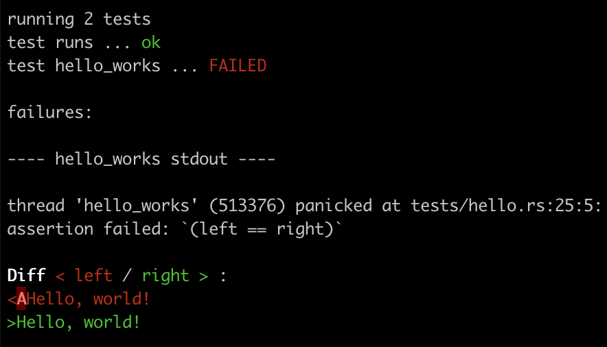

# Table of contents
- [Table of contents](#table-of-contents)
- [Chapter 1](#chapter-1)
  - [`rustc`](#rustc)
  - [`cargo`](#cargo)
  - [Integration tests](#integration-tests)
  - [Dev dependencies](#dev-dependencies)
  - [Testing binary exists](#testing-binary-exists)
  - [Testing program exit values](#testing-program-exit-values)
  - [Command: `false`](#command-false)
    - [`src/bin/false.rs`](#srcbinfalsers)
    - [`tests/false.rs`](#testsfalsers)
  - [Command: `true`](#command-true)
    - [`src/bin/true.rs`](#srcbintruers)
    - [`tests/true.rs`](#teststruers)
  - [Testing program output](#testing-program-output)

<br>

# Chapter 1
## `rustc`
Run `rustc main.rs`, it creates a new file `main` in the **current dir**. This is a **binary-encoded file** that can be **directly executed by your operating system**, so it’s common to call this an **executable** or a **binary**.<br>
Recall that the binary exists in target/debug/hello. If you try to execute `main` on the command line, you will get an **error** that the **program can’t be found**.<br>
To run binary add `./` before binary: `./main`. This is because the `$PATH` environment variable that lists the directories to search for programs to run. The **current working directory** is **never included** in `$PATH` to prevent malicious code from being surreptitiously executed.<br>

<br>

To **list all paths** in `$PATH` run:
```bash
echo $PATH | tr ':' '\n'
```

<br>

## `cargo`
If you would like for `cargo` to **not** print status messages about **compiling** and **running** the code, you can use the `-q`, or `--quiet`, option:
```bash
cargo run -q
Hello, world!
```

<br>

**By default**, `cargo` will build a **debug target**, so you will see the directory `target/debug` that contains the binary file called `command-line-rust`:
```bash
./target/debug/command-line-rust
Hello, world!
```

<br>

Why was the binary file called `command-line-rust`, though, and not `main`? To answer that, look at Cargo.toml:
```toml
[package]
name = "command-line-rust"
version = "0.1.0"
edition = "2024"
```

The **name of package** will be used by default for **bin** crate that is being built from `main.rs` if there is **no explicit** name for crate.<br>
**Editions** are how the Rust community **introduces changes that are not backward compatible**.<br>

<br>

Example of **explicit name** for **binary crate**:
```toml
[[bin]]
name = "hello"
path = "src/main.rs"
```

```bash
cargo run -q --bin hello
Hello, world!
```

<br>

## Integration tests
The convention in Rust projects is to create a `tests` *directory* for **integration tests parallel** to the `src` *directory*:
```rust
#[test]
fn works() {
    assert!(true);
}
```

<br>

Test that **executes a command** and checks the **exit code** is **zero**:
```rust
use std::process::Command;
#[test]
fn runs() {
    let mut cmd = Command::new("./target/debug/hello");
    let res = cmd.output();
    assert!(res.is_ok())
}
```

<br>

- `cmd.output()` *runs* the **command** and *captures* the **output**;
- `res.is_ok()` verifies that the result is an `Ok` variant, indicating the action **succeeded**;

<br>

## Dev dependencies
The development dependencies tell Cargo that I need these crates **only** for **testing** and **benchmarking**:
```toml
[dev-dependencies]
assert_cmd = "2.2.2"
pretty_assertions = "1.4.1"
```

<br>

## Testing binary exists
The `assert_cmd` to create a `Command` that looks in the `target/release` and `target/debug`:
```rust
use assert_cmd::Command;
#[test]
fn run() {
    let mut cmd = Command::cargo_bin("hello").unwrap();
    cmd.assert().success();
}
```

<br>

- `Command::cargo_bin("hello")` returns a `Result`, and then code calls `Result::unwrap()` because the **binary should be found** and returns `Command`;
  - **if binary doesn't exist**, then `unwrap` will cause a **panic** and the **test will fail**, which is a good thing;
- `cmd.assert()` runs a `Command` and make assertions on the `Output`;
- `cmd.assert().success()` expects **success**, i.e. **exit code** is **0**;
- `cmd.assert().failure()` expects **fail**, i.e. **exit code** is **not equal to 0**;

<br>

## Testing program exit values
What does it mean for a program to run successfully? Command-line programs should report a **final exit status** to the operating system to indicate **success** or **failure**.<br>
The **POSIX** standards dictate that the standard *exit code* is **0** to indicate **success** (think **zero errors**) and any number from **1** to **255** otherwise.<br>

There are 2 commands:
- `true` always returns **zero** *exit code*;
- `false` always returns **nonzero** *exit code*;

<br>

Write own versions of `true` and `false` in `src/bin` directory.<br>

<br>

## Command: `false`
### `src/bin/false.rs`
```rust
fn main() {
    std::process::exit(1);
}
```

<br>

**Run**:
```bash
cargo run -q --bin false
echo $?
1
```

<br>

### `tests/false.rs`
```rust
use assert_cmd::Command;

#[test]
fn false_works() {
    let mut cmd = Command::cargo_bin("false").unwrap();
    cmd.assert().failure();
}
```

<br>

## Command: `true`
### `src/bin/true.rs`
```rust
use assert_cmd::Command;

#[test]
fn false_works() {
    let mut cmd = Command::cargo_bin("true").unwrap();
    cmd.assert().success();
}
```

<br>

**Run**:
```bash
cargo run -q --bin true
echo $?
0
```

<br>

### `tests/true.rs`
```rust
use assert_cmd::Command;

#[test]
fn false_works() {
    let mut cmd = Command::cargo_bin("true").unwrap();
    cmd.assert().success();
}
```

<br>

## Testing program output
Example of test, that checks that program actually prints the **correct output** to `STDOUT`:
```rust
use assert_cmd::Command;
use pretty_assertions::assert_eq;

#[test]
fn hello_works() {
    let mut cmd = Command::cargo_bin("hello").unwrap();
    let output = cmd.output().expect("fail");
    assert!(output.status.success());
    let stdout = String::from_utf8(output.stdout).expect("invalid UTF-8");
    assert_eq!(stdout,"Hello, world!\n");
}
```

- `cmd.output().expect("fail")` **executes** command and **prints** the output of the command or **panics** with the message "fail";
- `output.status.success())` returns `true` if the command **succeeded**;
- `String::from_utf8(output.stdout).expect("invalid UTF-8")` converts the output of the program to **UTF-8**;
- `assert_eq!(stdout,"Hello, world!\n")` compares the **actual output** from the program to an **expected value**;
  - this uses the `pretty_assertions` version of the `assert_eq` macro;

<br>

Change `src/main.rs` and intentionally change a message to a value that the **test does not expect**. The `pretty_assertions::assert_eq` prints out **full-fledged diff**:<br>


<br>
